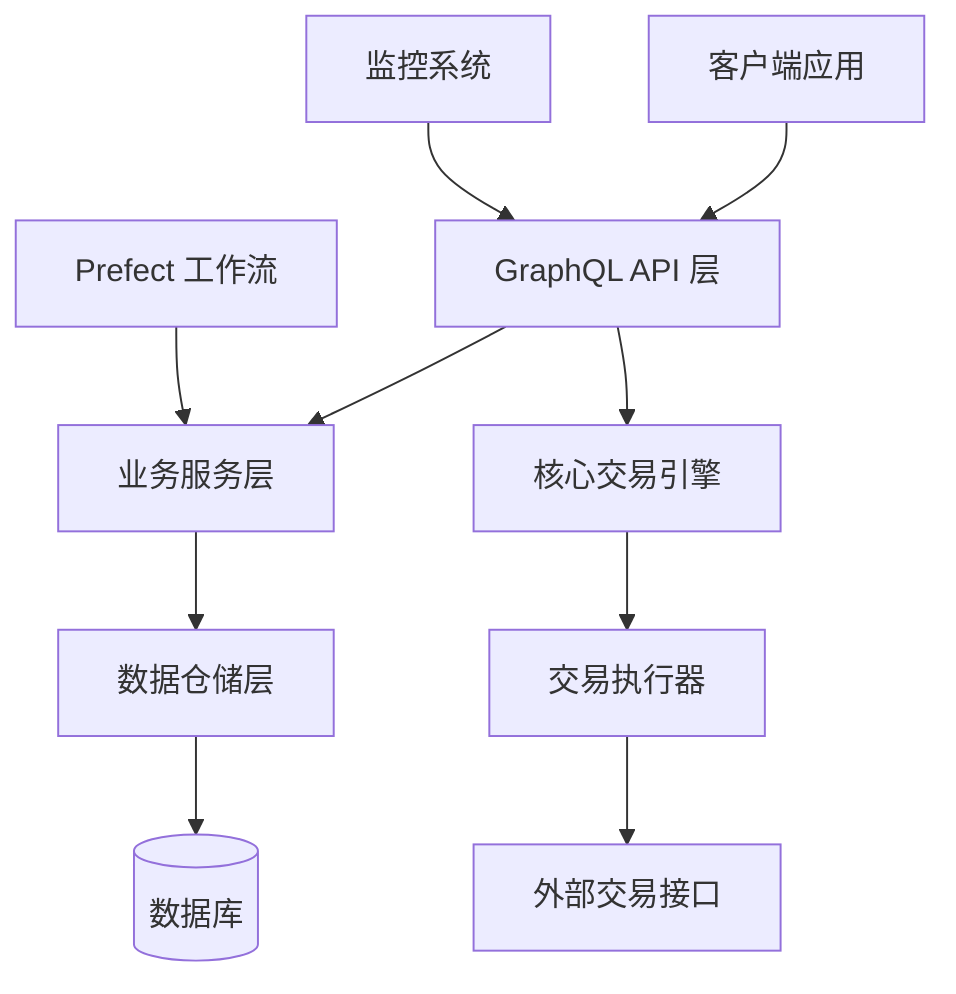
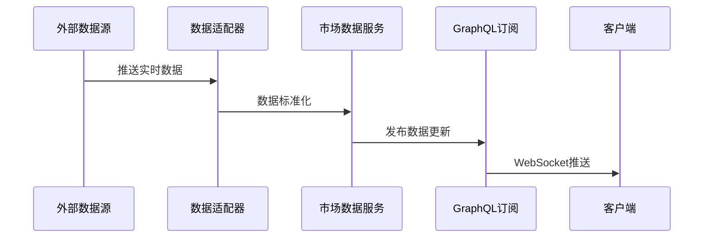
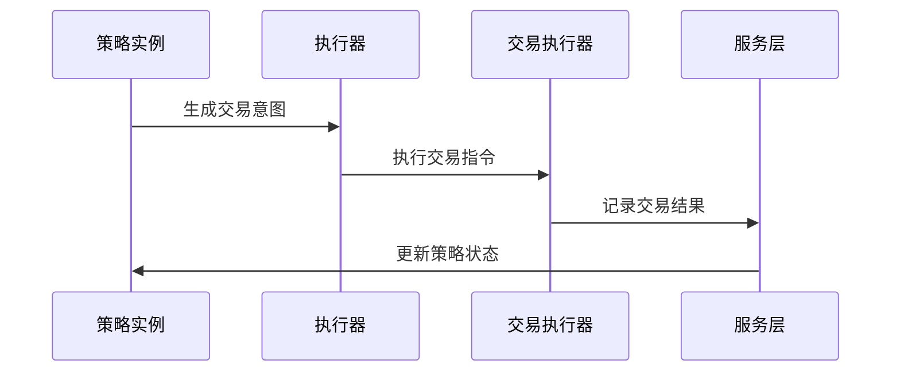
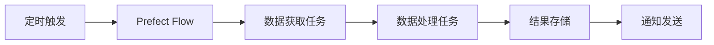

# 🏗️ QuantX 系统架构

QuantX 是一个现代化的量化交易系统，采用多层架构设计，支持策略开发、回测、实盘交易和工作流编排。

## 📋 目录

- [架构概览](#架构概览)
- [技术栈](#技术栈)
- [核心组件](#核心组件)
- [数据流](#数据流)
- [部署架构](#部署架构)
- [扩展性设计](#扩展性设计)

## 🎯 架构概览

QuantX 采用分层架构设计，从上到下分为：



### 架构特点

- **松耦合设计**：各层之间通过接口解耦，便于测试和维护
- **异步处理**：支持异步数据处理和实时推送
- **可扩展性**：模块化设计，易于扩展新功能
- **高可用性**：支持多实例部署和故障恢复

## 🛠️ 技术栈

### 核心框架
- **FastAPI** - 高性能 Web 框架，提供自动API文档
- **Strawberry GraphQL** - 现代化的 GraphQL 库
- **Prefect 3.x** - 工作流编排和任务调度
- **SQLAlchemy** - ORM 和数据库抽象层

### 数据存储
- **PostgreSQL 13+** - 主数据库，存储配置和元数据
- **InfluxDB 3.x** - 时序数据库，存储市场数据和指标
- **Redis 6+** - 缓存和会话存储

### 量化接口
- **XTQuant** - 专业量化交易接口
- **自研适配器** - 统一数据接口

### 监控工具
- **Prometheus** - 指标收集
- **Grafana** - 可视化监控（配置）

## 🔧 核心组件

### 1. GraphQL API 层 (gqlapi/)

```
gqlapi/
├── app.py                  # FastAPI 应用入口
├── schema.py              # GraphQL Schema 定义
├── resolvers/             # GraphQL 解析器
│   ├── strategies.py      # 策略相关查询/变更
│   ├── instruments.py     # 工具相关接口
│   ├── orders.py          # 订单管理
│   └── realtime.py        # 实时数据推送
├── types/                 # GraphQL 类型定义
└── schemas/               # 数据模型Schema
```

**职责**：
- 提供统一的 API 接口
- 处理用户请求和响应
- 实现 WebSocket 订阅
- 集成身份验证和授权

### 2. 核心交易引擎 (core/)

```
core/
├── strategy_manager.py    # 策略管理器
├── executor.py           # 策略执行器
├── strategies/           # 策略实现
│   ├── base.py          # 策略基类
│   └── examples/        # 示例策略
├── indicators/           # 技术指标
├── brokers/             # 交易执行器
├── data/                # 数据适配器
└── trading/             # 交易域：意图、风控、账本
```

**职责**：
- 策略生命周期管理
- 技术指标计算
- 交易意图生成、风控和处理
- 多种运行模式（回测/模拟/实盘）

### 3. 工作流编排 (prefector/)

```
prefector/
├── flow_manager.py       # 流程管理器
├── flows/               # 工作流定义
│   ├── market_data_flow.py  # 市场数据同步
│   ├── trading_flow.py      # 交易流程
│   └── report_flow.py       # 报告生成
└── tasks/               # 任务定义
    ├── market_tasks.py  # 市场数据任务
    └── trading_tasks.py # 交易任务
```

**职责**：
- 自动化任务调度
- 数据同步和处理
- 批量操作执行
- 错误处理和重试

### 4. 业务服务层 (services/)

```
services/
├── market_data_service.py    # 市场数据服务
├── strategy_service.py       # 策略服务
├── position_service.py       # 持仓服务
├── order_service.py          # 订单服务
└── notification_service.py   # 通知服务
```

**职责**：
- 业务逻辑封装
- 数据验证和转换
- 缓存管理
- 外部接口集成

### 5. 数据仓储层 (repositories/)

```
repositories/
├── base.py              # 基础仓储类
├── strategy_repo.py     # 策略数据仓储
├── market_data_repo.py  # 市场数据仓储
└── order_repo.py        # 订单数据仓储
```

**职责**：
- 数据访问抽象
- SQL查询优化
- 事务管理
- 数据一致性保证

## 🔄 数据流

### 1. 实时数据流



### 2. 策略执行流



### 3. 工作流处理



## 🚀 部署架构

### 单机部署

```
┌─────────────────┐
│   QuantX API    │
├─────────────────┤
│   PostgreSQL    │
│   InfluxDB      │
│   Redis         │
└─────────────────┘
```

### 分布式部署

```
┌─────────────────┐    ┌─────────────────┐
│  QuantX API-1   │    │  QuantX API-2   │
└─────────────────┘    └─────────────────┘
         │                       │
         └───────┬───────────────┘
                 │
┌─────────────────────────────────────────┐
│              负载均衡器                  │
└─────────────────────────────────────────┘
                 │
┌─────────────────┐    ┌─────────────────┐
│   PostgreSQL    │    │    InfluxDB     │
│   (Primary)     │    │   (Cluster)     │
└─────────────────┘    └─────────────────┘
         │
┌─────────────────┐
│  Redis Cluster  │
└─────────────────┘
```

## 🔄 扩展性设计

### 1. 策略扩展

- **策略基类**：统一的策略接口，支持自定义实现
- **指标库**：可扩展的技术指标计算框架
- **意图处理**：结构化 TradeIntent、风控裁决和账本归因

### 2. 数据源扩展

- **适配器模式**：统一的数据接口，支持多种数据源
- **插件架构**：动态加载数据源插件
- **缓存策略**：多级缓存提高数据访问效率

### 3. 交易接口扩展

- **经纪商适配**：支持多种交易接口
- **订单路由**：智能订单分发
- **风控模块**：可配置的风险控制规则

## 🔒 安全设计

### 1. 身份认证
- JWT Token 认证
- 角色权限控制
- API 访问限流

### 2. 数据安全
- 数据库连接加密
- 敏感信息脱敏
- 审计日志记录

### 3. 网络安全
- HTTPS 强制加密
- 跨域请求控制
- 防SQL注入

## 📊 性能优化

### 1. 数据库优化
- 索引策略
- 查询优化
- 连接池管理

### 2. 缓存策略
- Redis 缓存热点数据
- 查询结果缓存
- 会话缓存

### 3. 异步处理
- 异步I/O操作
- 消息队列
- 后台任务处理

---

**相关文档**：
- [功能模块详解](./MODULES.md)
- [API接口文档](./API.md)
- [部署指南](./DEPLOYMENT.md)
- [性能调优指南](./PERFORMANCE.md)
