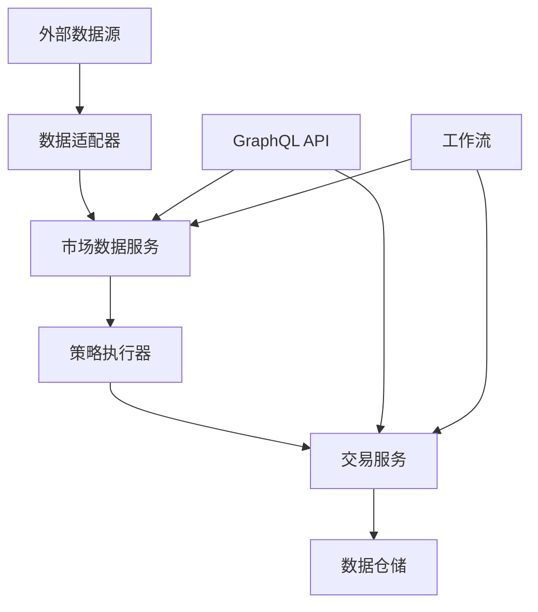
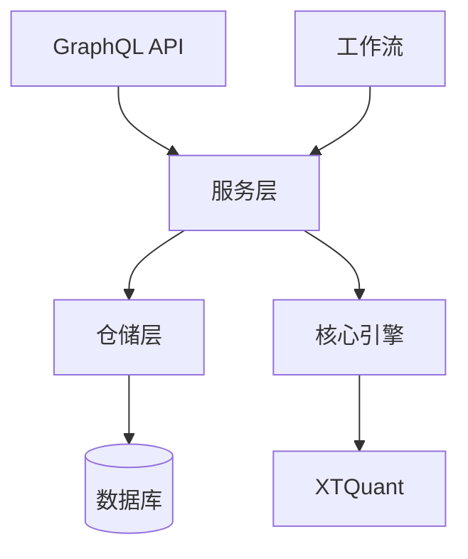

# 📦 QuantX 功能模块

本文档详细介绍 QuantX 系统各功能模块的职责、接口和使用方法。

## 📋 目录

- [核心交易引擎 (core/)](#核心交易引擎-core)
- [GraphQL API (gqlapi/)](#graphql-api-gqlapi)
- [工作流编排 (prefector/)](#工作流编排-prefector)
- [业务服务层 (services/)](#业务服务层-services)
- [数据仓储层 (repositories/)](#数据仓储层-repositories)
- [XTQuant集成 (miniqmt/)](#xtquant集成-miniqmt)
- [数据模型 (models/)](#数据模型-models)

## 🎯 核心交易引擎 (core/)

核心交易引擎是 QuantX 的核心，负责策略管理、交易执行和数据处理。

### 📁 模块结构

```
core/
├── strategy_manager.py      # 策略管理器
├── executor.py             # 策略执行器
├── config.py               # 核心配置
├── strategies/             # 策略模块
│   ├── base.py            # 策略基类
│   └── examples/          # 示例策略
│       ├── ma_cross.py    # 移动平均交叉策略
│       ├── rsi_strategy.py # RSI策略
│       ├── mean_reversion.py # 均值回归策略
│       └── tick_bar_strategy.py # Tick级别策略
├── indicators/             # 技术指标
│   ├── base.py            # 指标基类
│   ├── ma.py              # 移动平均
│   ├── rsi.py             # 相对强弱指数
│   ├── macd.py            # MACD
│   └── bollinger.py       # 布林带
├── brokers/               # 交易执行器
│   ├── base.py            # 基础交易器
│   ├── backtest.py        # 回测交易器
│   ├── simulator.py       # 模拟交易器
│   └── live.py            # 实盘交易器
├── data/                  # 数据适配器
│   ├── adapter.py         # 数据适配器基类
│   ├── historical.py      # 历史数据
│   └── realtime.py        # 实时数据
└── signals/               # 历史信号适配目录，当前主路径使用 TradeIntent
    ├── adapter.py         # Intent 适配器
    └── generator.py       # Intent 生成器
```

### 🔧 主要组件

#### 1. 策略管理器 (StrategyManager)

**文件**: `core/strategy_manager.py`

**职责**:
- 策略生命周期管理（创建、启动、停止、销毁）
- 策略实例注册和维护
- 策略状态监控
- 多模式运行支持（回测/模拟/实盘）

**核心方法**:
```python
class StrategyManager:
    def register_strategy(self, strategy: StrategyBase) -> str
    def start_strategy(self, strategy_id: str, mode: StrategyRunMode)
    def stop_strategy(self, strategy_id: str)
    def get_strategy_status(self, strategy_id: str) -> StrategyStatus
    def list_active_strategies() -> List[StrategyInfo]
```

#### 2. 策略基类 (StrategyBase)

**文件**: `core/strategies/base.py`

**核心类型**:
- `StrategyRunMode`: 策略运行模式（回测/模拟/实盘）
- `StrategyContext`: 策略运行上下文
- `StrategyInput`: 策略唯一输入快照
- `StrategyOutput`: 策略唯一输出
- `TradeIntent`: 策略层交易意图
- `RuntimeStatePatch`: 策略算法状态补丁
- `OrderStateEvent` / `TradeExecutionEvent`: 结构化订单与成交事件

**生命周期方法**:
```python
class StrategyBase(ABC):
    @abstractmethod
    def on_init(self) -> None
        """策略初始化"""

    @abstractmethod
    async def step(self, input: StrategyInput) -> StrategyOutput
        """统一策略决策入口"""

    def on_order(self, event: OrderStateEvent) -> RuntimeStatePatch | None
        """订单状态更新"""

    def on_trade(self, event: TradeExecutionEvent) -> RuntimeStatePatch | None
        """成交回调"""
```

#### 3. 技术指标库

**位置**: `core/indicators/`

**可用指标**:
- **MA (移动平均)**: 简单移动平均、指数移动平均
- **RSI (相对强弱指数)**: 超买超卖指标
- **MACD**: 趋势跟踪指标
- **Bollinger Bands**: 布林带指标

**使用示例**:
```python
from core.indicators import MA, RSI, MACD

# 计算技术指标
ma20 = MA(period=20).calculate(prices)
rsi = RSI(period=14).calculate(prices)
macd_line, signal_line, histogram = MACD().calculate(prices)
```

#### 4. 交易执行器

**位置**: `core/brokers/`

**类型**:
- **BacktestBroker**: 回测环境交易执行
- **SimulatorBroker**: 模拟交易环境
- **LiveBroker**: 实盘交易接口

**接口规范**:
```python
class BaseBroker(ABC):
    @abstractmethod
    def place_order(self, order: Order) -> OrderResponse

    @abstractmethod
    def cancel_order(self, order_id: str) -> bool

    @abstractmethod
    def get_positions(self) -> List[Position]

    @abstractmethod
    def get_account_info(self) -> AccountInfo
```

#### 5. 交易域执行链路

**位置**: `core/trading/`

当前策略执行主链路为：

```text
StrategyInput -> StrategyBase.step()
    -> StrategyOutput.trade_intents
    -> OrderSizer.draft_intent()
    -> RiskContextCaps / PositionAdjustmentProfile
    -> OrderRiskDecision
    -> Broker.place_order()
    -> OrderStateEvent / TradeExecutionEvent
```

**核心类型**:
- `EnvironmentLayer`: 将大盘、行业、概念、流动性、市场宽度和个股量价结构压缩为 `MarketContextSnapshot`。
- `MarketContextSnapshot`: 环境层输出快照，包含 `market_state`、`sector_state`、`concept_heat_state`、`liquidity_state`、`breadth_state`、`volume_structure`、`context_score`、`risk_tags` 和 `data_quality`。
- `ContextRiskLayer`: 在策略 `step()` 前生成 `RiskContextCaps`，约束风险模式、最大仓位、新增买入额度、现金缓冲、熔断和 T+1 置换开关。
- `RiskContextCaps`: 策略、仓位调节层和后置订单风控共享的前置风控快照。
- `PositionAdjustmentLayer`: 将 `market_context`、`risk_caps`、组合快照和策略状态翻译为仓位调节 profile。
- `PositionAdjustmentProfile`: 策略消费的仓位边界、core/swing 拆分、现金缓冲和 bucket 买卖许可。
- `OrderDraft`: `OrderSizer` 输出的候选订单草案，记录原始目标、修正后数量和修正原因。
- `OrderRiskLayer`: 在 `OrderSizer` 后校验 A 股交易规则、现金、可卖量、T+1 库存置换、环境风险和熔断。
- `OrderRiskDecision`: 后置风控决策，支持 `ALLOW`、`CAP`、`DELAY`、`REJECT`、`KILL_SWITCH`，并可携带 `substitution_plan`。
- `RiskAction`: 风控动作枚举。

策略不得直接创建真实订单数量；真实数量必须由 `OrderSizer` 与后置风控共同确定。

## 🌐 GraphQL API (gqlapi/)

提供统一的 GraphQL 接口，支持查询、变更和实时订阅。

### 📁 模块结构

```
gqlapi/
├── app.py                 # FastAPI应用
├── schema.py              # 主GraphQL Schema
├── resolvers/             # 解析器
│   ├── strategies.py      # 策略相关
│   ├── instruments.py     # 工具相关
│   ├── orders.py          # 订单管理
│   ├── positions.py       # 持仓管理
│   ├── account.py         # 账户信息
│   └── realtime.py        # 实时数据
├── types/                 # GraphQL类型
│   ├── strategy_types.py  # 策略类型
│   ├── market_data_types.py # 市场数据类型
│   ├── trading_types.py   # 交易类型
│   └── common_types.py    # 通用类型
└── schemas/               # 数据Schema
    ├── strategy_schema.py
    ├── trading_schema.py
    └── portfolio_schema.py
```

### 🔧 主要功能

#### 1. 查询接口 (Query)

**策略查询**:
- `strategies`: 获取策略列表
- `strategy(id: ID!)`: 获取特定策略信息
- `strategyPerformance`: 策略绩效数据

**市场数据查询**:
- `instruments`: 获取交易工具列表
- `marketData`: 获取市场数据
- `klines`: 获取K线数据

**交易查询**:
- `orders`: 获取订单列表
- `positions`: 获取持仓信息
- `trades`: 获取交易记录

#### 2. 变更接口 (Mutation)

**策略管理**:
- `createStrategy`: 创建策略
- `updateStrategy`: 更新策略
- `startStrategy`: 启动策略
- `stopStrategy`: 停止策略

**交易操作**:
- `placeOrder`: 下单
- `cancelOrder`: 撤单
- `modifyOrder`: 修改订单

#### 3. 订阅接口 (Subscription)

**实时数据推送**:
- `marketDataStream`: 实时市场数据
- `orderUpdates`: 订单状态更新
- `tradeStream`: 成交推送
- `strategyUpdates`: 策略状态更新

## 🔄 工作流编排 (prefector/)

基于 Prefect 3.x 的工作流编排系统，负责自动化任务调度和数据同步。

### 📁 模块结构

```
prefector/
├── flow_manager.py             # 流程管理器
├── prefect_manager.py          # Prefect管理器
├── flow_deployment_manager.py  # 部署管理器
├── flows/                      # 工作流定义
│   ├── daily_market_data_sync_flow.py    # 日市场数据同步
│   ├── realtime_price_flow.py            # 实时价格流
│   ├── comprehensive_market_flow.py      # 综合市场流
│   ├── batch_stock_flow.py              # 批量股票流
│   ├── bond_repo_flow.py                # 债券回购流
│   └── daily_trading_sync_flow.py       # 日交易同步流
└── tasks/                      # 任务定义
    ├── market_data_tasks.py    # 市场数据任务
    ├── trading_tasks.py        # 交易任务
    ├── stock_tasks.py          # 股票任务
    ├── bond_tasks.py           # 债券任务
    └── report_tasks.py         # 报告任务
```

### 🔧 主要工作流

#### 1. 市场数据同步流
- **每日数据同步**: 股票、债券、指数数据
- **实时数据流**: 实时价格推送处理
- **数据质量检查**: 数据完整性验证

#### 2. 交易流程
- **自动交易**: 策略意图执行
- **风控检查**: 交易前风险控制
- **结算处理**: 交易后处理

#### 3. 报告生成
- **绩效报告**: 策略绩效分析
- **风险报告**: 风险指标计算
- **监管报告**: 合规报告生成

## 🏢 业务服务层 (services/)

封装业务逻辑，提供统一的服务接口。

### 主要服务

#### 1. 市场数据服务 (MarketDataService)
```python
class MarketDataService:
    def get_realtime_data(self, symbols: List[str]) -> List[MarketData]
    def get_historical_data(self, symbol: str, start: date, end: date) -> List[KLine]
    def subscribe_realtime_data(self, symbols: List[str]) -> AsyncIterator[MarketData]
```

#### 2. 策略服务 (StrategyService)
```python
class StrategyService:
    def create_strategy(self, config: StrategyConfig) -> Strategy
    def update_strategy(self, strategy_id: str, config: StrategyConfig)
    def start_strategy(self, strategy_id: str, mode: StrategyRunMode)
    def get_strategy_performance(self, strategy_id: str) -> PerformanceMetrics
```

#### 3. 交易服务 (TradingService)
```python
class TradingService:
    def place_order(self, order_request: OrderRequest) -> Order
    def cancel_order(self, order_id: str) -> bool
    def get_positions(self, account_id: str) -> List[Position]
    def get_account_info(self, account_id: str) -> AccountInfo
```

## 🗄️ 数据仓储层 (repositories/)

提供数据访问抽象，实现数据持久化操作。

### 主要仓储

#### 1. 策略仓储 (StrategyRepository)
- 策略配置的CRUD操作
- 策略运行历史记录
- 策略绩效数据存储

#### 2. 市场数据仓储 (MarketDataRepository)
- 实时数据存储（InfluxDB）
- 历史数据查询优化
- 数据压缩和清理

#### 3. 交易仓储 (TradingRepository)
- 订单记录管理
- 交易历史存储
- 持仓数据维护

## 🔌 XTQuant集成 (miniqmt/)

与 XTQuant 量化交易平台的集成模块。

### 功能特性

#### 1. 数据接口
- 实时行情订阅
- 历史数据获取
- 基础信息查询

#### 2. 交易接口
- 订单下达和撤销
- 持仓查询
- 账户信息获取

#### 3. 回调处理
- 行情数据回调
- 交易状态回调
- 错误处理机制

## 📊 数据模型 (models/)

定义系统中使用的数据模型。

### 主要模型

#### 1. 交易相关
- **Order**: 订单模型
- **Position**: 持仓模型
- **Trade**: 成交模型
- **Account**: 账户模型

#### 2. 市场数据
- **Instrument**: 交易工具
- **KLine**: K线数据
- **Tick**: Tick数据
- **MarketData**: 市场数据

#### 3. 策略相关
- **Strategy**: 策略配置
- **StrategyInstance**: 策略实例
- **Performance**: 绩效数据

## 🔧 模块间协作

### 数据流向



### 调用关系



---

**相关文档**：
- [系统架构](./ARCHITECTURE.md)
- [API接口文档](./API.md)
- [使用示例](./EXAMPLES.md)
- [开发指南](./CODING_STANDARDS.md)
