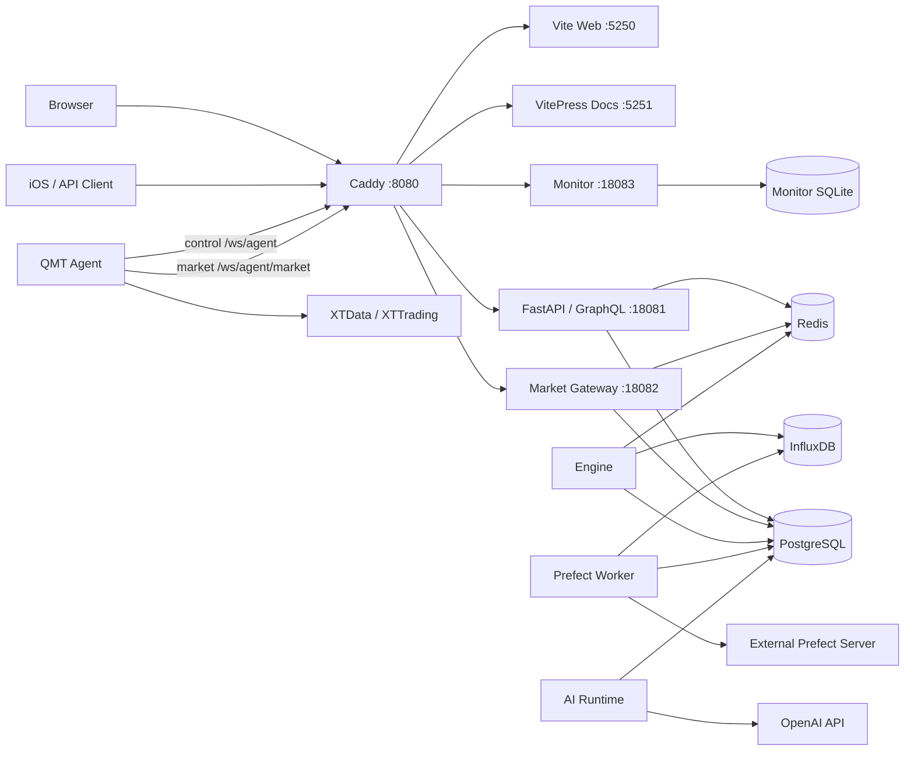

# QuantX 系统架构设计

> 2026-09-07：公共退出、admission 与独立 PAPER shadow 已完成业务库 0050 迁移及
> 清空功能数据后的 Windows full/live 启动验收。PAPER shadow 不注册真实订单 handler；
> 当前部署与数据清理边界以实施方案检查点为准，不代表进入 P4 或开放新 T owner 下单。

| 项目     | 内容                                                |
| -------- | --------------------------------------------------- |
| 文档状态 | 当前已实现架构（As-Is）                             |
| 版本     | 3.1                                                 |
| 核验日期 | 2026-09-03                                          |
| 适用范围 | Windows Dev、个人单账户、A 股量化交易               |
| 当前协议 | Agent 控制协议 `1.2`；行情子协议 `quantx.market.v2` |

> 本文只描述当前代码已经实现并由测试、运行脚本或工程契约约束的系统架构。
> `docs/architecture` 中标注“目标架构，待实施”的文档不属于当前运行基线。

## 1. 文档定位

### 1.1 本文回答什么

本文定义 QuantX 的系统级不变量：

- 哪些进程构成当前运行时，以及每个进程拥有什么；
- 哪些存储保存权威状态，哪些组件只承担缓存、广播或观测；
- 实时行情、策略决策、订单投递、券商回报和历史数据如何流转；
- Windows Dev 的启动、降级、恢复和安全边界；
- 当前实现与待实施目标架构之间的明确分界。

协议字段、GraphQL Schema、策略公式、状态机字段和易变阈值不在本文重复定义，
它们分别由 `packages/contracts`、GraphQL Schema、交易契约和各应用工程文档负责。

### 1.2 当前系统边界

QuantX 当前是个人使用的单账户 A 股量化系统，不是多租户 SaaS。唯一受支持的
运行形态是当前 Windows 工作区中的 `dev`：

- 普通开发启动默认连接个人单账户实盘能力；
- QMT Agent 是唯一允许访问 XTData/XTTrading 的进程；
- Web、iOS 和其他客户端只通过 Caddy 暴露的服务端契约访问系统；
- PostgreSQL、Redis、InfluxDB 和 Prefect Server 由外部环境提供；
- Monitor 独立运行，只观测，不参与交易判定；
- Research 是离线只读应用，不属于常驻在线主链。

当前不支持也不为以下形态预留兼容设计：

- 多账户、多租户、订阅计费或组织隔离；
- production、Kubernetes、WinSW、release 安装/回滚或 macOS 服务端；
- API 进程内的策略 Engine、Prefect Worker 或 QMT 子进程管理；
- 旧协议双写、旧实现降级或未经确认的未来抽象。

### 1.3 权威依据与维护规则

发生不一致时，按以下顺序核对当前行为：

1. 运行代码、版本化契约、数据库迁移、测试和 `ops/quantx.ps1`；
2. 本文记录的系统边界和架构不变量；
3. 各应用工程文档和交易域细化契约；
4. 标注为目标、计划、迁移或历史归档的文档。

代码与本文不一致应视为需要原子修复的缺陷，不能用本文为旧实现背书。协议调整
必须同时更新 contracts、服务端、Agent、客户端、测试和相关文档。

## 2. 架构原则

### 2.1 单账户优先

账户、授权、风控和容量模型只服务当前个人单账户。不得为臆想的多账户或多租户
需求增加字段、状态、分支或兼容层。

### 2.2 进程所有权唯一

API、Market Gateway、Engine、Worker、AI Runtime、QMT Agent 和 Monitor 是独立
进程。一个业务能力只能有一个运行时 owner；进程间通过版本化协议、数据库消息箱
或只读投影协作，不能跨进程直接操纵对方的内存对象。

### 2.3 持久事实先于通知

PostgreSQL 中的业务表、inbox、outbox 和审计记录是在线业务真源。Redis 只用于
实时行情物化、唤醒、广播、短租约和派生缓存。丢失 Redis 通知可以增加延迟，不能
丢失订单、成交、策略运行或审批事实。

### 2.4 券商事实与系统意图分离

`TradeIntent`、命令入队和 `command_ack` 都不是成交。实盘委托、成交、资金和持仓
事实只能来自 QMT Agent 上报的券商回报与权威完整账户快照；成交状态由真实 TRADE
回报推进，完整快照用于对账和重建当前事实。

### 2.5 决策与执行解耦

策略只通过 `StrategyBase.step(StrategyInput)` 输出 `TradeIntent[]` 和算法状态补丁。
真实数量、T+1、涨跌停、停牌、可卖量、资金、整手、零股清仓、授权和最终下单由
交易域、风控、OrderSizer、容量服务和 Broker 链路处理。

### 2.6 默认安全失败

行情缺口、账户快照不完整、对账未完成、所有权不明确、数据库结果不确定或协议不
匹配时，系统必须关闭新增风险。撤单和明确的风险降低型操作保留独立逃生路径，不能
被普通委托门禁反向阻断。

## 3. 运行拓扑



图中 Caddy、API、Market Gateway、Engine、AI Runtime、Web、Docs、Worker 和可用时的
QMT Agent 由统一启动器管理。Monitor 使用独立生命周期；iOS 和浏览器是客户端；
Prefect Server、PostgreSQL、Redis 与 InfluxDB 是外部依赖。

### 3.1 唯一公开入口

Caddy 监听 `0.0.0.0:8080`，是主运行时唯一公开入口。本机使用
`http://127.0.0.1:8080`，当前局域网基线使用 `http://192.168.5.6:8080`。

| 路径                                           | 目标                             | 说明                             |
| ---------------------------------------------- | -------------------------------- | -------------------------------- |
| `/graphql*`、`/auth*`、`/health*`、`/metrics*` | API `127.0.0.1:18081`            | GraphQL、认证和健康接口          |
| `/ws/agent`、`/agent/*`                        | API `127.0.0.1:18081`            | Agent 控制、报告和历史上传控制面 |
| `/ws/agent/market`                             | Market Gateway `127.0.0.1:18082` | 唯一实时全市场行情连接           |
| `/monitor/*`                                   | Monitor `127.0.0.1:18083`        | 公开只读状态页 API               |
| `/monitor/internal/*`                          | 固定返回 `404`                   | Monitor 内部观测数据不公开       |
| `/docs/*`                                      | VitePress `127.0.0.1:5251`       | 客户端与工程文档                 |
| 其他路径                                       | Vite `127.0.0.1:5250`            | Web 应用                         |

QMT Agent 另提供 `0.0.0.0:18084` 只读健康端点，只用于独立 Monitor 探测；该端点
不接受交易命令，也不暴露账户、凭据、QMT 路径或异常堆栈。

### 3.2 运行配置

| 启动方式                                           | 解析结果                             | 运行范围                                        |
| -------------------------------------------------- | ------------------------------------ | ----------------------------------------------- |
| `up -Environment dev -Profile web`                 | `profile=full`、`agentMode=live`     | 启动完整主运行时，并在 QMT 预检通过后启动 Agent |
| `up -Environment dev -Profile web -Mode data-only` | `profile=web`、`agentMode=data-only` | 显式关闭实盘能力，不启动 Worker 或 QMT Agent    |
| `up -Environment dev -Component monitor`           | 独立 Monitor                         | 不改变主运行时生命周期或交易门禁                |

QMT 登记或本地运行时预检失败时，启动器保留请求的 `full/live` 身份，但关闭服务端
和 Agent 的全部实盘能力门、清空账户允许列表、跳过 QMT 进程，并以
`DEGRADED / BLOCKED` 启动其余服务。该状态不是 `data-only`，也不能伪装成 QMT
`ready`；修复 QMT 后必须整体重启。

## 4. 进程职责与所有权

| 进程或应用     | 当前拥有                                                                     | 明确不拥有                                           |
| -------------- | ---------------------------------------------------------------------------- | ---------------------------------------------------- |
| Caddy          | 公开路由、WebSocket 转发、公开边界                                           | 认证业务、策略、交易状态、健康判定                   |
| Web / iOS      | 用户交互、客户端状态、GraphQL 调用                                           | QMT 连接、账户真相、成交推进                         |
| API            | HTTP/GraphQL、认证授权、数据库访问、Agent 控制 Hub、订阅桥、命令发送前复核   | 策略调度、回报收敛、Prefect 生命周期、QMT SDK        |
| Market Gateway | `/ws/agent/market`、Agent 鉴权与行情租约、协议校验、Redis 原子提交、供给健康 | 账户交易能力、Engine 消费健康、策略和订单            |
| Engine         | 策略管理、自动退出、条件清仓、做 T、打板运行、热缓存、Agent 回报收敛         | HTTP 服务、QMT SDK、Prefect 调度                     |
| AI Runtime     | 模型循环、工具 allowlist、审批恢复、AI 运行租约和事件                        | 实盘交易、QMT、策略 `step()`、账户或订单状态推进     |
| Prefect Worker | flows、tasks、历史行情摄取、日级任务和可恢复后台作业                         | 策略 Engine、直接 QMT/XTData 调用、API 生命周期      |
| QMT Agent      | XTData/XTTrading、控制/行情出站连接、本地 journal、历史 spool、本地保护      | 服务端数据库、策略、账户业务状态机                   |
| Monitor        | 独立探测、去抖、事故历史、状态页只读 API                                     | 交易门禁、自动恢复决策、主服务生命周期               |
| Research       | 离线只读研究、不可变本地产物                                                 | 常驻在线服务、行情同步、业务数据库写入、交易信号发布 |

Market Gateway 的源代码位于 `apps/api`，但它是独立 ASGI 进程，不属于 API 的
lifespan。API 重启不会因此中断已经建立的行情数据面；控制连接和行情连接拥有不同
故障域。

### 4.1 API

API 是无持久内存状态的边界进程。它可以持有当前连接和有界队列，但所有可恢复
业务状态必须先落 PostgreSQL。API mutation 只创建应用命令、审批记录或持久消息，
不能同步宣称策略已完成、券商已受理或订单已成交。

### 4.2 Engine

Engine 使用 PostgreSQL advisory lock 保证同一数据库只有一个实例取得执行权。
核心数据面先启动，交易运行域再通过持久化所有权审计开放。策略管理、人工计划、
做 T、打板、清仓和自动退出不能由 API、Worker 或 Monitor 代为执行。

### 4.3 Worker

Worker 连接外部 Prefect Server，使用固定 `quantx-pool`。需要 QMT 历史数据时，
Worker 创建持久化 `market_data_request`，等待在线 Agent 上传并由摄取任务收敛，
而不是导入 `xtquant` 或调用 QMT Agent 本地对象。

### 4.4 QMT Agent

QMT Agent 只建立出站 HTTP/WS 连接，并在本机访问 XTData/XTTrading。它在完成控制
认证、journal 校验和必要对账之前不开启普通委托门。服务端协议、账户白名单和本地
保护必须同时通过；Agent 模式与命令 `execution_mode` 必须完全一致，不能把 live
命令降级为 paper。

### 4.5 Monitor

Monitor 的健康结论是观测结果，不是交易安全真源。账户实盘准入只由 API 内的安全
服务判定；Monitor 读取脱敏快照并留痕，自身不可用不会打开或关闭交易能力。

## 5. 代码分层与依赖方向

### 5.1 Monorepo 分层

| 目录                      | 职责                                                       |
| ------------------------- | ---------------------------------------------------------- |
| `packages/contracts`      | Agent 线协议、市场流协议、DTO 和公共枚举                   |
| `packages/domain`         | 纯交易域、策略、风控、仓位、退出计划和回测 Broker          |
| `packages/application`    | 用例、端口、命令路由和状态推进契约                         |
| `packages/infrastructure` | SQLAlchemy 模型、Repository、Redis/Influx 适配和持久消息箱 |
| `apps/*`                  | 独立进程、客户端或离线应用的组合根                         |
| `ops/*`                   | Windows Dev 生命周期、Caddy、备份、迁移和验证入口          |

### 5.2 依赖规则

允许的主方向是：

```text
apps -> application / domain / infrastructure / contracts
application -> domain contracts + ports
infrastructure -> application ports + domain/contracts
qmt-agent -> contracts + QMT SDK
clients -> GraphQL / HTTP / WebSocket contracts
```

必须保持以下硬边界：

- `quantx_domain` 不依赖数据库、文件、网络、FastAPI、Prefect 或 QMT；
- `apps/api`、`apps/engine`、`apps/worker` 不导入 `miniqmt` 或 `xtquant`；
- QMT Agent 不导入服务端 ORM、Repository、策略或应用用例；
- API 不导入 Engine、Worker 或 AI Runtime 的运行实现；
- AI Runtime 不导入 API、Engine、QMT Agent 或 QMT SDK；
- Monitor 不导入交易域并且不向主系统回写健康状态。

## 6. 状态真源与存储边界

| 数据类别                                                                   | 权威真源                                                              | 其他组件的角色                                        |
| -------------------------------------------------------------------------- | --------------------------------------------------------------------- | ----------------------------------------------------- |
| 用户、授权、账户控制、策略运行、计划、意图、订单、成交、仓位、bucket、审计 | PostgreSQL                                                            | API 读写用例；Engine 串行推进；Redis 只通知           |
| Engine/API/Worker/AI Runtime 心跳与持久命令                                | PostgreSQL                                                            | 健康聚合和消费者从数据库恢复                          |
| 实盘券商事实                                                               | QMT Agent 上报的券商回报和权威完整快照                                | API 先写 inbox；Engine 收敛为 PostgreSQL 投影         |
| 实时全市场行情                                                             | QMT/XTData 来源；Market Gateway 在 Redis 中提交当前流、水位和最新快照 | Engine `WholeQuoteHub` 校验并消费；Redis 不是历史真源 |
| 历史 Tick/K 线                                                             | InfluxDB                                                              | PostgreSQL 保存请求、清单、质量和摄取审计             |
| Agent 命令幂等与未确认报告                                                 | Windows 本地 SQLite journal                                           | 服务端 ACK 后清理；重连按原消息 ID 重放               |
| Agent 历史上传中间件                                                       | Windows 本地不可变 gzip spool                                         | 成功摄取后清理；网络失败幂等续传                      |
| Monitor 样本、事故和汇总                                                   | Monitor 独立 SQLite                                                   | 主系统只读取脱敏结果，不据此改变门禁                  |
| AI 对话、运行、事件、审批和 RunState                                       | PostgreSQL                                                            | Redis 只唤醒 AI Runtime 和订阅方                      |
| Prefect 调度状态                                                           | 外部 Prefect Server                                                   | Worker 执行；业务完成证据仍按具体 flow 落库           |
| Research 数据集和报告                                                      | `.runtime` 下不可变本地产物及清单                                     | Research 只读权威数据源，不写在线业务状态             |
| 券商凭据、设备密钥和 QMT 路径                                              | Windows Credential Manager 与 Agent 本机配置                          | 服务端只保存设备登记哈希和脱敏元数据                  |

### 6.1 PostgreSQL 消息箱

当前在线链路使用三类持久边界：

- `engine_command_outbox`：API 发起、由 Engine 执行的策略和助手控制命令；
- `trade_command_outbox`：已经完成持久化和风控、等待 API 投递给 Agent 的交易命令；
- `agent_report_inbox`：API 已接收并持久化、等待 Engine 收敛的 Agent 原始报告。

消费者必须支持重复投递、进程重启和处理租约恢复。业务幂等键、消息 ID、数据库
唯一约束和状态 CAS 共同保证至少一次传输不会变成重复交易。

### 6.2 Redis 的正确用途

Redis 可以保存：

- 实时行情最新快照、流身份、水位和 freshness lease；
- Engine/API/AI Runtime 的消费者唤醒；
- GraphQL 订阅广播和派生只读缓存。

Redis 不得成为订单、成交、持仓、bucket、审批、策略 RuntimeState 或事故历史的
唯一副本。订阅方收到通知后仍应从 PostgreSQL 读取权威投影。

### 6.3 bucket 归因

`locked_core/core/swing` 的用户名称分别为“封存仓/核心仓/活跃仓”。策略只能在
意图中请求逻辑 bucket；QMT Agent 不发送 bucket 变更。真实成交进入 Engine 后，
由交易域结合意图、订单和 T+1 置换账本完成归因。

## 7. 核心数据流

### 7.1 实时行情链路

```text
XTData whole quote
  -> QMT Agent 单一原生全市场订阅
  -> /ws/agent/market（quantx.market.v2）
  -> Market Gateway 校验并原子提交 Redis
  -> Engine WholeQuoteHub 校验 stream_id + sequence + 来源时间
  -> 策略、退出监控、做 T、打板雷达和暖缓存
  -> PostgreSQL 事件 / Redis 派生读模型
  -> API GraphQL / Subscription
  -> Web / iOS
```

行情数据面与 Agent 控制面分离。Market Gateway 只判断供给是否完整、连续和新鲜；
Engine 单独报告消费水位与收敛状态；账户实盘准入同时检查 Agent、供给和 Engine
消费，不能用“网关健康”替代端到端就绪。

新流必须经过全量快照、连续性屏障和 readiness-confirm 后才进入 `READY`。精确批次
序号、容量、时间预算和重同步规则由 contracts、API、QMT Agent 与 Engine 工程文档
共同约束，本文不复制易变参数。

### 7.2 策略决策与订单链路

一次标准交易决策按以下顺序推进：

1. Engine 从权威行情、组合、订单和运行状态构造时点一致的输入；
2. 前置上下文风控生成 `RiskContextCaps`；
3. 仓位调节层生成策略可用的 `PositionAdjustmentProfile`；
4. Engine 调用 `StrategyBase.step(StrategyInput)`；
5. 整批 `TradeIntent` 先通过严格持久化受理边界，算法状态再由 RuntimeState 快照和 CAS 提交；
6. 需要审批的意图等待绑定精确版本的挑战，其他意图继续路由；
7. 所有 LIVE BUY 先进入账户级 `EXECUTION_READY` 池，由公共 admission sequencer
   对当前集合确定性排序并提交 durable batch/claim；此时尚未取得
   `AccountExecutionControl FOR UPDATE`，Engine 启动与后台恢复扫描负责续接 READY/PREPARED；
   风险降低动作不进入该队列；
8. OrderSizer、A 股规则、后置订单风控和 `AccountCapacityService` 按 rank 计算最终合法订单；
9. pending order 与 `trade_command_outbox` 在同一持久事务中建立；
10. API Agent Hub 领取命令，发送前重新校验账户、Agent、行情和命令状态；
11. QMT Agent 再做模式、白名单、过期、对账和本地安全检查后调用 XTTrading。

风控只能允许、限额、延迟、拒绝或熔断原意图，不能把 BUY 反向改成 SELL。强制减仓
必须由独立、可审计的风险降低意图产生。

### 7.3 命令确认与券商回报

```text
trade_command_outbox
  -> API 控制 WebSocket
  -> QMT Agent 本地 journal / 串行 XTTrading worker
  -> command_ack
  -> QMT 委托与成交回调
  -> QMT Agent 先写 journal
  -> API 先写 agent_report_inbox 再 ACK
  -> Engine 幂等消费
  -> Order / Trade / Position / Bucket / ExitPlan / RuntimeState
```

当前控制面只支持唯一的 Agent 协议 `1.2`。业务 owner 不进入 Agent wire payload：
服务端在 `TradeIntent`、pending、correlation、`trade_command_outbox` 和 runtime event
上保存不可为空的 `ExecutionOwnerRef(owner_type, owner_id)` 与 execution environment，
并在发送前通过 durable correlation 证明归属。`PLACE_ORDER` payload 固定为 10 个字段
（`command_kind`、`client_order_id`、`account_id`、`execution_mode`、`instrument_code`、
`side`、`price_type`、`limit_price`、`volume`、`expires_at`）；`CANCEL_ORDER` payload
固定为 6 个字段（`command_kind`、`client_order_id`、`account_id`、`execution_mode`、
`broker_order_id`、`expires_at`）。PLACE 只接受 `BUY/SELL`、`FIX_PRICE` 和有限正数
`limit_price`；QMT 原生调用使用空 `strategy_name`，remark 固定为 `qx:` 加
`client_order_id` 前 20 个字符。

`command_ack` 只表示投递或 Agent 本地处理结果，不表示券商受理或成交。订单终态与
TRADE 是独立报告；Agent 回报先持久化到 `agent_report_inbox`，Engine 再按 correlation
和 owner/environment 精确路由。未知、未注册或冲突 owner 一律 fail-closed；终态声明的
累计成交量领先于真实 TRADE 时必须保留关联并进入 `RECONCILE_REQUIRED`，不能凭委托终态
伪造成交或释放库存。

Engine 把原始报告转换成稳定业务键的 `strategy_runtime_events`，按 owner/environment
串行应用，并
使用数据库 CAS 提交 RuntimeState、订单、成交、持仓、bucket 和退出计划。结果不确定
时安装 durable barrier，在幂等收敛前阻止该运行继续消费关键行情或确认新意图。

### 7.4 历史行情摄取

```text
Worker 创建 market_data_request
  -> API 通过控制面投递给当前活动 QMT Agent
  -> Agent 的受监督 XTData-only 子进程分片读取
  -> Agent 生成不可变 gzip spool 和 manifest
  -> HTTP 分块上传到服务端 staging
  -> Worker 校验集合、顺序、摘要、SHA 和资源预算
  -> InfluxDB 写入历史数据
  -> PostgreSQL 原子保存摄取审计与 COMPLETED
```

历史任务不能阻塞实时行情、控制心跳、账户快照或 XTTrading。Worker 和回测均不直接
访问 QMT SDK；网络或 InfluxDB 暂时失败时保留持久请求和不可变 spool 幂等恢复。

### 7.5 回测链路

回测与实盘调用同一个 `StrategyBase.step(StrategyInput)`，但 Broker 实现隔离。回测
Broker 仍模拟订单受理、拒绝、部分成交、T+1、涨跌停、停牌、费用和回报收敛，不能把
`TradeIntent` 直接视为成交。历史 BAR 只在完成后可见，时间线必须阻止未来数据泄露。

### 7.6 AI Assistant 链路

```text
Web -> API 写 Thread / Message / Run -> PostgreSQL
Redis 仅唤醒 -> AI Runtime 租约领取 -> 模型与 allowlisted tools
AI Runtime -> PostgreSQL 追加事件、审批状态和 RunState
API -> 先回放数据库、再通过订阅推送 Web
```

AI Runtime 当前只允许读取授权范围内的业务事实，以及经逐次人工批准创建非实盘
回测重跑命令。`TRADING` 和 `ADMIN` 风险工具永久禁止注册；模型不能直接下单、撤单、
调用策略 `step()` 或改变账户交易授权。

### 7.7 独立观测链路

Monitor 直接探测 PostgreSQL、Redis、InfluxDB、Prefect、Web、Docs、API、Market
Gateway 和 QMT Agent；Engine、Worker 与 AI Runtime 主要从 API 的脱敏组件快照派生。
采样、去抖、事故和汇总只写 Monitor SQLite。状态页读取失败只影响可观测性，不改变
主系统的交易能力。

## 8. 策略运行与执行所有权

### 8.1 策略接口

所有策略实现统一异步入口：

```python
async def step(self, input: StrategyInput) -> StrategyOutput:
  ...
```

策略可以维护可持久化算法状态，但不得：

- 读取账户、数据库、文件、网络或 QMT；
- 自行计算最终可买、可卖、冻结资金或合法委托数量；
- 在发出信号时修改真实持仓、现金、订单或成交状态；
- 用 `Signal/on_bar/on_tick/generate_signal` 恢复另一条主执行路径；
- 对固定标的实例自行选股，或让动态策略直接读取候选数据源。

动态 Universe 由 Engine 的 Provider/Coordinator 在策略外部解析，再通过标准
`StrategyInput` 和 `RECONCILE` 输入进入同一个 `step()`。

### 8.2 当前 `StrategyRun` 状态

当前持久化枚举只有：

```text
PENDING / RUNNING / PAUSED / STOPPED / COMPLETED / ERROR
```

删除、熔断、账户暂停、对账和 kill switch 是其他聚合的动作或状态，不能伪造成
`StrategyRun` 的额外状态。

### 8.3 当前执行 owner

P1 原子切换后，公共持久化链使用强类型
`ExecutionOwnerRef(owner_type, owner_id)` 与 execution environment。`TradeIntent`、
pending、`order_correlations`、`trade_command_outbox` 和 `strategy_runtime_events`
都要求 owner 身份；`auto_exit_plans` 与 `TTradeBatch` 以
`source_execution_owner_type/source_execution_owner_id/source_execution_environment`
保存来源 owner。`strategy_run_id` 仍可作为 StrategyRun 的可选一致性见证，但不能在
owner 缺失时被推断为默认 owner。

当前业务映射仍保留旧做 T/托管入口的 StrategyRun 运行容器；P2 已完成公共退出、
容量和风险增加准入地基，但尚未把新做 T runtime 接入真实下单链：

| 业务                                                                             | 当前持久 owner / 运行容器                                      | 当前调度位置                                           |
| -------------------------------------------------------------------------------- | -------------------------------------------------------------- | ------------------------------------------------------ |
| 普通策略                                                                         | `STRATEGY_RUN/<run_id>`                                        | `StrategyManager`                                      |
| 做 T 助手入场                                                                    | `STRATEGY_RUN/<run_id>`（legacy 运行）                         | 原运行的串行策略队列                                   |
| 做 T 助手隔离影子                                                                | `T_ASSISTANT_EXECUTION/<execution_id>`（仅 `PAPER`）           | WholeQuoteHub CRITICAL consumer + 独立 cycle supervisor |
| 打板助手入场                                                                     | `STRATEGY_RUN/<run_id>`（legacy 运行）                         | 原运行的串行策略队列                                   |
| 托管买入计划                                                                     | `STRATEGY_RUN/<run_id>` 绑定当前计划版本                       | 原运行的 managed entry strategy                        |
| `T_TRADE_BATCH`、`LIMIT_UP_BOARD`、`FIRST_BOARD_PROMOTION_V2`、`ENTRY_PLAN` 退出 | `EXIT_PLAN/<plan_id>`；另存不可变 source execution owner       | 公共 `ExitPlanRuntime`                                 |
| `MANUAL_POSITION`、`MANUAL_LIQUIDATION`                                         | `EXIT_PLAN/<plan_id>`；来源由 `MANUAL_COMMAND` 见证            | 公共 `ExitPlanRuntime`                                 |
| 人工直接交易命令                                                                   | `MANUAL_COMMAND/<command_id>`                                 | API/Engine 公共命令链                                  |

当前 `OwnerRuntimeRouter` 仅注册 `STRATEGY_RUN`、`EXIT_PLAN`、`MANUAL_COMMAND` 三类
handler；`T_ASSISTANT_EXECUTION`、`ENTRY_PLAN`、`BOARD_ASSISTANT_EXECUTION` 等未注册
owner，以及 owner/environment 或来源链冲突，均 fail-closed，不会生成 Agent outbox。

P3 的隔离影子与 legacy 做 T StrategyRun 同时观察同一 WholeQuoteHub accepted Tick，按
逐标的本地 accepted sequence 归约，并以全局 market fence 保留因果身份。每个新 cycle 只与
相同 StrategyRun、标的、generation、source time、tick ordinal 和 market fence 的旧 V3
机会证据比较；无精确证据时持久化 `UNAVAILABLE`，不会退化为读取最新 UI 投影。影子
proposal 只保存在 `PAPER` cycle material 中，公共 runtime router 仍不注册该 owner。

因此，以下文档仍描述后续目标，不能据此假设当前已经开放独立
`TAssistantExecution`、`BoardAssistantExecution` 或 `EntryPlanRuntime` 真实订单：

- [多标的做 T 助手新架构设计](多标的做T助手新架构设计.md)
- [多标的做 T 助手新架构开发实施方案](../plans/多标的做T助手新架构开发实施方案.md)
- [打板助手新架构设计](打板助手新架构设计.md)
- [买入/卖出计划新架构设计](买入卖出计划新架构设计.md)

未来实施这些目标时，必须在代码、数据库、contracts、客户端、测试和本文中一次性
切换所有权；不得长期保留两套 owner 或双协议。当前 protocol 1.2 与三类已注册 owner
是 As-Is；P2 的公共退出 runtime、账户容量水位和跨域 admission 已成为共享地基，
P3/P4 的独立做 T producer 与真实订单仍未开放。
做 T 的实际迁移阶段、阻塞项和验证证据只在开发实施方案中追踪；目标设计中的阶段描述不表示
当前代码已经完成，本文也只有在对应阶段成为默认运行事实后才更新。

## 9. 生命周期、配置与恢复

### 9.1 主运行时启动顺序

统一入口是仓库根目录的 `ops/quantx.ps1`。正常 `up` 顺序为：

1. 读取环境配置，解析真实运行 profile 和 agent mode；
2. 检查端口、外部依赖、唯一账户、QMT Python 与登记状态；
3. 启动 Market Gateway，并只等待 `/health/live`；
4. 启动 API，并等待 `/health/live`；
5. 启动 Engine 与 AI Runtime；
6. 启动 Vite Web，生成 GraphQL 文档引用并启动 VitePress；
7. `full` profile 检查外部 Prefect，部署 flows 并启动 Worker；
8. QMT 预检通过时启动唯一 QMT Agent；
9. 最后启动 Caddy，再执行 profile 对应的整体 readiness 验收。

Market Gateway 在 Agent 之前启动时不能用 `/health/ready` 阻塞，因为完整行情连接尚未
建立。Monitor 必须用独立 `-Component monitor` 命令启动，普通 `up/down` 不管理它。

### 9.2 配置来源

服务端配置由 Pydantic Settings 读取：

1. `apps/api/.env`；
2. `apps/api/.env.<ENV>`；
3. 可选的 `QUANTX_ENV_FILE` 显式覆盖文件；
4. 进程环境变量。

QMT 设备密钥不进入这些文件。运行脚本负责把同一次启动解析出的 profile、模式、账户
和能力门传给各进程，禁止每个进程自行猜测另一套运行形态。

### 9.3 数据库 Schema

SQLAlchemy 模型定义当前 ORM Schema；Alembic 保存版本化前向迁移。Dev API 初始化会
以 `create_all(checkfirst=True)` 建立缺失对象，但这不是替代迁移的发布机制。数据库
演进使用：

```powershell
.\ops\quantx.ps1 migrate -Environment dev
```

不得恢复旧文档中的 GORM AutoMigrate、Go struct 真源或“没有迁移”的设计。

### 9.4 停止与独立恢复

- `down` 只停止 `.runtime/state` 中 PID 和启动时间都匹配的受管进程；
- API 停止只清理 API 自己的 Hub、sweeper、heartbeat 和数据库连接；
- Engine 停止按 producer、串行事件、策略快照、Broker 的顺序收口；
- Worker 由 Prefect 的持久 deployment 和 flow state 恢复；
- QMT Agent 用本地 journal 重放未确认报告，不重复调用 broker；
- Market Gateway 独立于 API 控制面，API 重启不要求重建原生 whole-quote 订阅；
- Monitor 在主服务离线期间继续记录故障，普通主运行时重启不清空其历史。

## 10. 故障处理与一致性

| 场景                               | 当前系统行为                                                                    |
| ---------------------------------- | ------------------------------------------------------------------------------- |
| QMT 未登记或运行时不可用           | 保持 `full/live` 请求，禁用实盘门并以 `DEGRADED / BLOCKED` 启动非 QMT 服务      |
| Agent 控制连接中断                 | 停止普通命令；重连后重放 journal、上传完整快照并重新对账                        |
| PostgreSQL 暂时不可用              | API 不 ACK 未落库报告，对 socket 施加有界背压并暂停命令轮询；Agent 保留 journal |
| Redis 或行情提交失败               | 行情流失效并重同步；新增风险关闭；PostgreSQL 业务事实不丢失                     |
| 行情序号缺口、旧 Tick 或新鲜度失效 | `WholeQuoteHub` 停止关键分发，收敛完整快照后才恢复 `READY`                      |
| Engine 进程或租约失败              | supervisor 重启；advisory lock 防止双实例；持久命令和报告从数据库恢复           |
| Engine owner 审计失败              | 核心数据面继续收敛，交易运行域降级并暂停受影响账户，不让孤儿计划触发重启循环    |
| 完整账户快照不完整或状态证明不合法 | 不应用其中资金、持仓和订单事实；账户保持或进入对账阻断                          |
| 委托终态领先 TRADE                 | 保留 pending 和期望成交量，进入 `RECONCILE_REQUIRED`，等待真实成交回报          |
| InfluxDB 摄取暂时失败              | 历史请求保留可恢复状态，不能影响实时交易事实                                    |
| AI Runtime 不可用                  | AI 运行等待恢复，不影响 API、Engine、Worker 或 QMT Agent                        |
| Monitor 不可用                     | 丢失观测能力，但不改变账户交易门禁                                              |

取消、紧急停止和明确的风险降低型卖出使用高优先级通道。普通委托的容量、对账或
行情门关闭时，这些故障逃生动作仍应尽可能可达。

## 11. 安全与交易门禁

### 11.1 实盘能力不是下单授权

QMT Agent 以 live 模式运行只表示本机具备读取和执行能力。一次新增风险操作仍需依次
满足：

```text
环境与总开关
  -> 唯一账户白名单
  -> Agent 会话和协议
  -> 权威完整快照与对账
  -> 账户 controlled window / 增仓授权
  -> Market Gateway 供给 READY
  -> Engine 消费收敛
  -> 风控、容量与审批
  -> Agent 本地复核
  -> XTTrading
```

任何较新的外部手工活动、账户异常、行情缺口或所有权冲突都可以关闭授权。授权恢复
必须基于新的权威事实和显式操作，不能由 Monitor、heartbeat 或旧 token 自动打开。

### 11.2 凭据边界

- 券商账号、密码、QMT 配置和设备密钥只留在 Windows Agent 主机；
- 设备密钥存 Windows Credential Manager，服务端只保存哈希；
- token、账户快照、异常堆栈和本地路径不得进入公开健康响应；
- 日志和数据库错误只保存脱敏原因码、异常类型和必要审计身份，不保存 SQL 参数或凭据；
- QMT Agent 的 HTTP/WS 根地址禁止凭据、重定向、系统代理和跨 scheme 回退。

### 11.3 客户端与 AI

Web、iOS 和其他客户端不能直连 QMT。审批只允许意图重新进入统一风控与执行链，
不代表订单已成交。AI 工具权限由服务端 allowlist 和运行时上下文决定，prompt 不能
扩大账户范围、权限或工具风险等级。

## 12. 已确认的架构决策

| 决策        | 当前结论                                                       |
| ----------- | -------------------------------------------------------------- |
| 产品形态    | 个人单账户，不做 SaaS 多租户                                   |
| 运行平台    | 仅 Windows Dev                                                 |
| 公开入口    | 仅 Caddy `8080`                                                |
| API 形态    | FastAPI + Strawberry GraphQL，持久状态外置                     |
| 行情接入    | 独立 Market Gateway；控制 `1.2` 与行情 `quantx.market.v2` 分离 |
| 策略执行    | 独立 Engine + PostgreSQL 单实例租约                            |
| QMT 边界    | 只有 QMT Agent 可导入 XTData/XTTrading                         |
| 业务真源    | PostgreSQL；Redis 只做实时物化、唤醒和广播                     |
| 历史行情    | InfluxDB，摄取完成证据在 PostgreSQL                            |
| 任务调度    | 外部 Prefect Server + 独立 Worker                              |
| AI          | 独立 AI Runtime，永久禁止实盘交易工具                          |
| 观测        | 独立 Monitor + SQLite，只读且不回写门禁                        |
| Schema 演进 | SQLAlchemy + Alembic 前向迁移                                  |
| 回测一致性  | 与实盘共享 `StrategyBase.step` 和订单/回报语义                 |
| 兼容策略    | 默认原子切换，不保留未部署版本或旧协议兼容层                   |

## 13. 文档索引

| 主题                               | 权威文档                                                                                |
| ---------------------------------- | --------------------------------------------------------------------------------------- |
| Windows Dev 启动、端口、备份和迁移 | [Windows Dev 运行与运维](../engineering/deployment/README.md)                           |
| API、GraphQL 和 Agent Hub          | [QuantX API 工程指南](../engineering/api/README.md)                                     |
| Engine、行情消费和回报收敛         | [QuantX Engine](../engineering/engine/README.md)                                        |
| QMT Agent、安全与协议实现          | [QuantX QMT Agent](../engineering/qmt-agent/README.md)                                  |
| Prefect flows 与历史摄取           | [QuantX Prefect Worker](../engineering/worker/README.md)                                |
| 独立可观测性                       | [QuantX Monitor 工程指南](../engineering/monitor/README.md)                             |
| AI Runtime                         | [QuantX AI Assistant 架构与集成指南](../engineering/ai-runtime/README.md)               |
| iOS 客户端                         | [QuantX iOS](../../apps/ios/README.md)                                                  |
| 离线研究                           | [QuantX Research](../../apps/research/README.md)                                        |
| 交易层调用顺序与职责               | [A 股三层协作与执行契约](../trading/contracts/A股三层协作与执行契约.md)                 |
| 交易数据结构与状态机               | [A 股交易域数据结构与状态机](../trading/contracts/A股交易域数据结构与状态机.md)         |
| 自动退出计划                       | [A 股自动退出计划与卖出策略契约](../trading/contracts/A股自动退出计划与卖出策略契约.md) |
| 做 T 独立执行 owner                | [目标：多标的做 T 助手新架构](多标的做T助手新架构设计.md)                               |
| 做 T 架构迁移状态                  | [计划：多标的做 T 助手新架构开发实施方案](../plans/多标的做T助手新架构开发实施方案.md)   |
| 打板独立执行 owner                 | [目标：打板助手新架构](打板助手新架构设计.md)                                           |
| 买入/卖出计划独立 owner            | [目标：买入/卖出计划新架构](买入卖出计划新架构设计.md)                                  |

维护本文时，只把跨进程拓扑、所有权、状态真源、核心数据流、启动恢复或安全边界的
变化提升到系统架构层；字段级细节继续留在唯一负责它的 contracts 或工程文档中。
