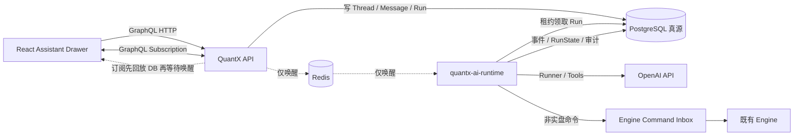
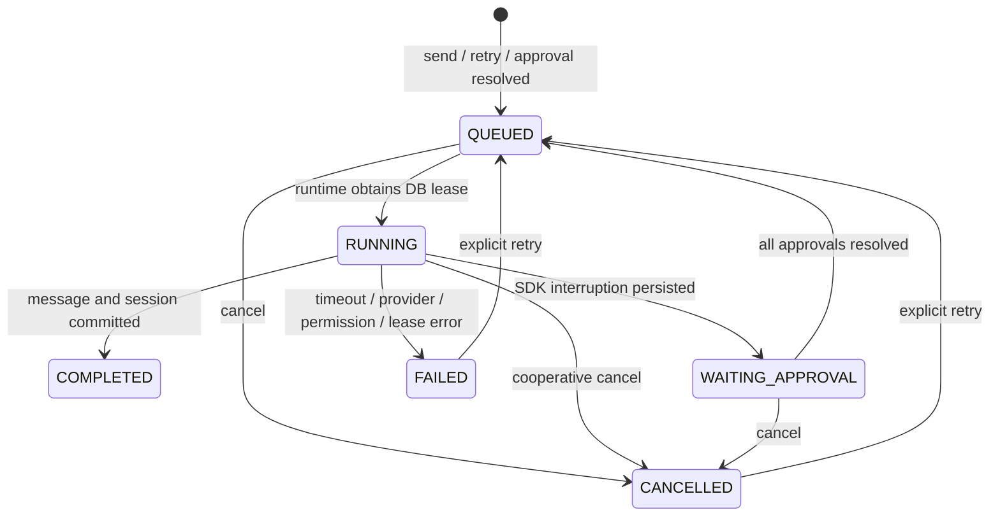

# QuantX AI Assistant 架构与集成指南

状态：已落地
基线日期：2026-08-14

本文定义 QuantX 产品内 AI Agents 的运行边界、目录组织、接口、审批与恢复
协议，以及后续接入连板分析和股票筛选的方法。它是工程契约，不是交易策略
规格；现有 API、Engine、Worker、交易域和 QMT Agent 均不因接入 AI 而重构。

## 1. 技术选型结论

产品运行时采用 **OpenAI Agents SDK for Python**，通过独立的
`quantx-ai-runtime` 进程接入。Hermes Agent 和 Codex SDK 不进入在线金融
业务主链。

| 方案 | 擅长场景 | 与 QuantX 在线产品的匹配度 | 决策 |
|---|---|---:|---|
| OpenAI Agents SDK | Python 内嵌编排、流式输出、函数工具、运行中断、人工审批、可序列化 `RunState` | 高；可放在现有 Python monorepo，并由 QuantX 自己掌握权限、数据库和状态机 | 当前运行时 |
| Hermes Agent | 通用个人自治 Agent、CLI/桌面/消息网关、技能与自增长记忆、多模型提供商 | 中；功能面很宽，但它自己的会话、工具、记忆和操作权限模型会与 QuantX 的账户隔离、审计及审批真源重叠 | 可作为研发/研究侧工具，不嵌入业务主链 |
| Codex SDK | 代码仓库、终端、沙箱、CI/CD 和工程任务 | 低；它是 coding-focused thread，不适合作为持仓研究与选股产品的领域运行时 | 继续用于开发自动化，不作为产品 Agent SDK |
| Responses API 直连 | 短生命周期、工具少、应用自行维护完整循环 | 中；可控但要自行实现工具循环、审批和恢复 | 保留为未来轻量 provider 适配方案 |

选型的关键不是“哪个 Agent 更聪明”，而是谁持有产品状态。QuantX 必须始终
持有用户、账户授权、工具审批、幂等写入、任务状态和审计记录；模型 SDK 只
负责推理循环。OpenAI 官方也将 Codex SDK 定位为 coding-focused threads，
而 Agents SDK 提供工具、guardrails、HITL 和可恢复运行状态。

参考：

- [OpenAI Agents SDK](https://openai.github.io/openai-agents-python/)
- [Agents SDK 人工审批](https://openai.github.io/openai-agents-python/human_in_the_loop/)
- [Agents SDK RunState](https://openai.github.io/openai-agents-python/ref/run_state/)
- [Codex SDK](https://developers.openai.com/codex/sdk/)
- [Hermes Agent](https://github.com/NousResearch/hermes-agent)

## 2. 目标与不可跨越的边界

### 2.1 当前能力

- 在任意 Studio 页面打开全局 AI 抽屉，创建、切换和删除对话。
- 流式解释标的、持仓和回测数据，并保存消息、引用与使用量。
- 显式附加页面路由、业务对象引用和一个已授权资金账户。
- 用户逐次开启外部网页搜索，结果保留来源链接和工具审计。
- 读取标的、账户持仓和当前用户的回测数据。
- 经逐次人工批准，向现有 Engine 命令箱创建非实盘回测重跑任务。
- 进程重启后恢复运行队列或待审批 `RunState`。

### 2.2 永久禁止

- AI Runtime 不导入 `miniqmt`、`xtquant`、`quantx_engine` 或
  `quantx_qmt_agent`。
- 不向 QMT Agent 发送命令，不创建、修改、撤销真实订单。
- 不调用策略 `step()` 代替 Engine，不推进策略或订单状态。
- 不访问券商凭证、交易密码、QMT 本地配置或设备密钥。
- 模型不能凭 prompt 给自己增加工具、权限或账户范围。
- `TRADING` 和 `ADMIN` 风险级工具在框架策略层永久拒绝注册和调用；它们不是
  “需要审批”，而是产品 AI 完全不可用。

## 3. 运行拓扑



PostgreSQL 是唯一状态真源。Redis 丢消息只会增加最多一个轮询周期的延迟，
不会丢运行或事件。API 不持有模型循环，AI Runtime 退出不会拖垮 API、Engine、
Worker 或 QMT Agent。

## 4. 代码目录与依赖方向

```text
apps/
├── ai-runtime/                         # 独立模型编排进程
│   ├── pyproject.toml
│   └── src/quantx_ai_runtime/
│       ├── main.py                     # 生命周期、信号与 fail-closed 启动
│       ├── config.py                   # 从共享 Settings 投影不可变配置
│       ├── observability.py            # ai-runtime 心跳
│       ├── agents/registry.py          # Agent 工厂；不放业务 SQL
│       ├── prompts/research_assistant.md
│       ├── guardrails/input_policy.py  # 输入长度与基础安全检查
│       ├── tools/registry.py           # 每次运行生成工具 allowlist
│       └── runtime/
│           ├── consumer.py             # DB 租约、并发与 Redis 唤醒
│           ├── runner.py               # 流式运行、HITL、消息与 usage
│           ├── recovery.py             # SDK RunState 序列化/恢复
│           └── event_writer.py         # DB 事件追加后 Redis 通知
├── api/src/quantx_api/gqlapi/
│   ├── schemas/ai_assistant_schema.py  # 鉴权、输入边界、GraphQL transport
│   └── types/ai_assistant_types.py     # 强类型内容块、事件与输入
└── web/src/features/ai-assistant/
    ├── api/assistant.gql               # 唯一前端 GraphQL 契约
    ├── hooks/useAiAssistant.ts         # 本地投影与订阅重放
    └── components/AssistantDrawer.tsx  # 全局 UI

packages/
├── application/src/quantx_application/assistant/
│   ├── contracts.py                    # SDK 无关 DTO / 枚举 / 元数据
│   ├── ports.py                        # Tool / Session / Event ports
│   └── policies.py                     # 永久风险策略与授权规则
└── infrastructure/src/quantx_infrastructure/
    ├── models/ai_assistant.py           # 持久化模型
    ├── repositories/ai_assistant_repository.py
    └── services/ai_assistant_event_bus.py

ops/
└── quantx.ps1                           # Windows dev/full/live 统一生命周期
```

允许的依赖方向：

```text
web -> GraphQL -> api -> application + infrastructure
ai-runtime -> application + domain + infrastructure + Agents SDK
infrastructure -> application/domain contracts where already allowed
```

禁止的依赖方向：

```text
domain -X-> Agents SDK / FastAPI / DB / network
api -X-> Agents SDK
engine / worker / qmt-agent -X-> ai-runtime
ai-runtime -X-> api / engine / qmt-agent / miniQMT
```

这使 provider 替换只发生在 `apps/ai-runtime`；工具的权限和风险契约仍保留在
`packages/application`，不会扩散到交易模块。

## 5. 框架无关接口

### 5.1 执行上下文

`AssistantExecutionContext` 是一次运行唯一可信的安全上下文：

```python
@dataclass(frozen=True)
class AssistantExecutionContext:
  user_id: str
  permissions: frozenset[str]
  authorized_account_ids: tuple[str, ...]
  thread_id: str
  run_id: str
  request_id: str
  account_id: str | None
  context_refs: tuple[AssistantContextRef, ...]
  external_search_enabled: bool
```

API 创建运行时写入上下文引用；Runtime 领取运行后再次从数据库读取当前用户
状态、权限和账户授权。撤销权限会令尚未执行的运行失败，不能依赖创建时的旧
权限快照。

页面上下文只传引用，不传未经裁剪的页面对象。目前允许：

`ROUTE`、`INSTRUMENT`、`STRATEGY_RUN`、`RESEARCH_RUN`、
`PORTFOLIO_ACCOUNT`、`SCREENING_RESULT`。

一个 run 最多 8 个引用、最多一个资金账户。Agent prompt 只能看到这些引用的
ID；要获得事实必须调用获准工具。

### 5.2 工具元数据

每个业务工具先声明 `AssistantToolMetadata`：

```python
AssistantToolMetadata(
  name="get_limit_up_chain_summary",
  version="1",
  description="读取指定交易日的连板梯队聚合结果",
  risk_level=AssistantToolRisk.READ,
  required_permissions=frozenset({"market:read"}),
  account_scoped=False,
  timeout_seconds=15,
  idempotent=True,
  external_data_classification="INTERNAL",
)
```

风险语义固定为：

| 风险 | 示例 | 策略 |
|---|---|---|
| `READ` | 标的、行情投影、持仓、研究结果 | 授权后直接执行并审计 |
| `COMPUTE` | 无副作用的指标计算、解释已有筛选结果 | 授权后执行，受超时/次数限制 |
| `NON_TRADING_WRITE` | 创建回测、研究或筛选任务 | 每个 tool call 逐次人工批准；必须幂等 |
| `TRADING` | 下单、撤单、改真实策略运行参数 | 永久禁止 |
| `ADMIN` | 用户、权限、密钥、系统设置 | 永久禁止 |

prompt 不是安全边界。`authorize_tool()`、per-run allowlist、数据库所有权查询和
具体工具实现必须同时通过，调用才可发生。

### 5.3 工具返回

工具返回面向模型的最小 JSON，并至少包含 `summary`。对于长数据集，只返回
前 N 条、聚合指标和 `referenceId`；完整结果仍由现有业务表/任务页面承载。
不得将 ORM 对象、异常堆栈、内部 SQL、密钥或无限行情序列直接交给模型。

## 6. 已开放的 Agent 与工具

当前只注册 `research_assistant`，避免一开始把“多 Agent”退化为大量不同
prompt。能力差异先用工具和结构化上下文表达；当某一研究流程有独立评估集、
输出契约和权限边界时，才拆出新 Agent。

| 工具 | 风险 | 权限 | 范围 |
|---|---|---|---|
| `get_instrument_snapshot` | `READ` | `market:read` | 标的基础资料、昨收、涨跌停与交易状态 |
| `get_portfolio_summary` | `READ` | `portfolio:read` | 仅显式附加且当前授权的账户，最多 50 个持仓 |
| `get_backtest_summary` | `READ` | `strategy:read` | 仅当前用户拥有的 StrategyRun |
| `create_backtest_rerun_task` | `NON_TRADING_WRITE` | `assistant:write`、`strategy:read` | 仅 BACKTEST；批准后进入既有 Engine command inbox |
| OpenAI hosted `web_search` | `READ` | 对话级 opt-in | 默认关闭；引用 URL 并写工具审计 |

## 7. 持久化模型与状态机

### 7.1 数据表

| 表 | 作用 |
|---|---|
| `ai_assistant_threads` | 用户、可选账户、Agent、标题、外部搜索开关 |
| `ai_assistant_messages` | 不可变消息内容块；用户 `client_message_id` 幂等 |
| `ai_assistant_session_items` | SDK 下一轮输入所需的 Responses item 投影 |
| `ai_assistant_runs` | 队列、租约、取消、usage、可恢复 `RunState` |
| `ai_assistant_events` | 每个 thread 单调递增事件流，供断线重放 |
| `ai_assistant_tool_calls` | 参数、风险、审批、结果、错误和幂等键 |
| `ai_assistant_deletion_audits` | 永久删除对话后的最小审计，不保留正文 |
| `ai_runtime_settings` | 全局非敏感期望配置、递增版本和修改人 |
| `ai_runtime_settings_audits` | 配置修改前后安全值、版本、用户和 request ID |

同一 thread 在 `QUEUED`、`RUNNING`、`WAITING_APPROVAL` 中最多存在一个
active run，由 PostgreSQL partial unique index 保证，不能只靠前端按钮。

### 7.2 运行状态



审批可一次出现多个 tool call。每个 call 单独批准或拒绝；只有所有 pending
call 都被处理，run 才重新入队。恢复时使用原 top-level Agent 反序列化 SDK
`RunState`，再按数据库审批结果执行 `approve()` / `reject()`。

若某次运行已经成功执行 `NON_TRADING_WRITE`，整个运行禁止直接 retry，以免
模型在新轨迹中产生另一个副作用。工具自身还使用
`run + tool + canonical arguments` 的幂等键，形成第二层保护。

### 7.3 租约和崩溃恢复

- Runtime 用 PostgreSQL `FOR UPDATE SKIP LOCKED` 语义领取队列。
- `RUNNING` 记录带 instance 与过期租约，运行期间按租约的约三分之一续租。
- 最终消息、SDK session 与 `COMPLETED` 在同一事务提交；所有完成/失败收敛都
  校验 lease owner，旧实例失去租约后不能覆盖新实例。
- 崩溃后过期租约可被新实例重新领取；session、工具调用和审批状态均在 DB。
- Redis 只通知“可能有新 run/event”，消费者始终回查 DB。
- API subscription 先从 `afterSequence` 回放 DB，再订阅 Redis；重连不丢事件。

## 8. GraphQL 接口设计

所有字段经过现有认证扩展。查询和订阅需要 `assistant:read`，变更需要
`assistant:write`；账户型 thread 还必须通过当前账户授权检查。

### 8.1 Query

| 字段 | 用途 |
|---|---|
| `aiAssistantCapabilities` | enabled、runtime heartbeat、模型、Agent、工具和限制 |
| `aiAssistantThreads(first, after)` | 当前用户可见 thread 的 cursor 分页 |
| `aiAssistantThread(id)` | 单个 thread |
| `aiAssistantMessages(threadId, afterSequence, limit)` | 按消息 sequence 分页 |

### 8.2 Mutation

| 字段 | 用途与约束 |
|---|---|
| `createAiAssistantThread(input)` | 创建研究对话；可预绑定一个授权账户 |
| `sendAiAssistantMessage(input)` | 写用户消息和 run，`clientMessageId` 保证重试幂等 |
| `cancelAiAssistantRun(runId)` | 请求协作式取消 |
| `retryAiAssistantRun(runId)` | 仅 FAILED/CANCELLED 且未成功写入的 run |
| `resolveAiAssistantApproval(input)` | 对指定 tool call 批准或拒绝 |
| `updateAiAssistantThread(input)` | 标题和对话级外部搜索 opt-in |
| `deleteAiAssistantThread(threadId)` | 无 active run 时永久删除，并写最小删除审计 |

### 8.3 Subscription

`aiAssistantEvents(threadId, afterSequence)` 提供以下事件：

- `RUN_STATUS_CHANGED`
- `MESSAGE_DELTA`
- `MESSAGE_COMPLETED`
- `TOOL_CALL_STARTED`
- `TOOL_CALL_COMPLETED`
- `APPROVAL_REQUIRED`
- `USAGE_RECORDED`
- `RUN_FAILED`

客户端必须保存最后消费的 `sequence`，重连时带回；不要把 websocket 是否连续
作为消息完整性的依据。

### 8.4 内容块

Assistant message 使用 GraphQL union，而不是不可演进的 Markdown 字符串：

`TEXT`、`CITATION`、`CONTEXT`、`TOOL_RESULT`、`TASK_REFERENCE`、`ERROR`。

未来股票筛选结果应返回 `TASK_REFERENCE` 或 `CONTEXT` 指向正式结果页面，
而不是把数千行证券列表塞入聊天正文。

## 9. 前端集成方式

`StudioWorkspace` 只负责全局入口和右侧抽屉，不改变现有 feature 路由。hook
自动附加当前路径；资金账户必须由用户显式开启后才附加。外部搜索同样是
thread 级显式开关，不因系统环境变量或历史 thread 自动扩大范围。

在业务页面附加对象时，仅追加引用：

```ts
contextRefs: [
  { kind: 'INSTRUMENT', objectId: '600000.SH', label: '浦发银行' },
  { kind: 'SCREENING_RESULT', objectId: resultId, label: '今日筛选结果' },
]
```

页面不要构造“请相信下面数据”的长 prompt，也不要把未授权账户快照直接作为
text 发送。服务端按引用重新查真源。

## 10. 新工具接入指南

新增工具按以下顺序进行：

1. 在现有领域/应用模块提供一个确定性查询或既有命令入口；不要为 AI 复制
   业务算法。
2. 在 `quantx_application.assistant` 声明所需 DTO 或 port，并确定风险、权限、
   账户范围、超时、数据分类和幂等语义。
3. 在 `apps/ai-runtime/.../tools/registry.py` 写薄适配器。所有权过滤应进入 SQL
   或 Repository 查询，不能先读全量再在 prompt 中过滤。
4. 通过 `_invoke_audited()` 调用；禁止直接把未审计的 Python function 放入
   Agent tools。
5. 对 `NON_TRADING_WRITE` 同时设置 SDK `needs_approval=True`、数据库
   `approval_required` 和稳定幂等键。
6. 在 GraphQL capabilities 中发布工具能力；前端只依赖能力结果，不硬猜服务端
   配置。
7. 添加策略授权测试、所有权测试、失败/超时测试、审批暂停恢复测试、工具结果
   schema 测试和 dependency boundary 测试。
8. 若 GraphQL schema 或 query 变化，按本文第 12 节通过 Caddy 重新 codegen。

审查清单：

- 工具能否改变实盘交易、权限或系统配置？若能，拒绝接入。
- 是否复用了现有 Repository/use case，而不是重写业务真相？
- 是否在运行时重新验证权限和账户？
- 输入是否有上限并规范化？输出是否有条数/字节上限？
- 写操作是否逐次审批、幂等且能给出正式任务引用？
- 日志与错误是否去除了账户隐私、prompt 和 provider 原始响应？

## 11. 连板分析与股票筛选的演进设计

后续场景通过“现有模块先产出确定性结果，Agent 再解释或创建任务”接入，不把
选股算法写进 prompt，也不让 Agent 读取账户后自主选股/下单。

### 11.1 连板分析

建议的既有业务产物：

- Worker 在收盘或指定盘中批次生成 `LimitUpChainSnapshot`。
- 快照包含交易日、板数、首次/最后封板时间、开板次数、封单、流通市值、行业/
  概念、数据质量与生成时间。
- 计算规则、交易日边界、ST/退市、停牌和未来数据约束放在 domain/application
  或已有研究任务中，并有确定性测试。

Agent 只增加两个薄工具：

- `get_limit_up_chain_summary(trading_date, board_count?, sector?)`：`READ`，读取已
  生成快照并解释梯队和缺失数据。
- `create_limit_up_research_task(parameters)`：`NON_TRADING_WRITE`，经批准投递
  Worker/Prefect 研究任务，返回 `RESEARCH_RUN` 引用。

### 11.2 股票筛选

建议把筛选条件做成版本化、可回放 DSL，由 application use case 校验并交给
Worker 执行。例如：

```json
{
  "asOf": "2026-08-14T15:00:00+08:00",
  "universe": "ASHARE_ACTIVE",
  "filters": [
    {"field": "limitUpStreak", "op": ">=", "value": 2},
    {"field": "turnoverRate", "op": "between", "value": [3, 25]}
  ],
  "sort": [{"field": "limitUpStreak", "direction": "DESC"}],
  "limit": 100
}
```

Agent 负责把自然语言转换为候选 DSL 并向用户说明；正式创建筛选任务属于
`NON_TRADING_WRITE`，批准后由 application 再次校验 DSL。执行结果写正式表，
返回 `SCREENING_RESULT` 引用。之后的对话只读取该不可变结果和数据时间。

### 11.3 与现有策略模块的关系

- 筛选/连板是研究或账户外的标的发现，不进入固定标的 `StrategyBase.step()`。
- StrategyRun 仍绑定一个 `instrument_code`；Agent 不修改这一约束。
- 把筛选结果转为关注列表、研究任务或新策略实例，分别走对应 application
  use case；任何实盘启用仍走现有人工流程和交易安全门。
- 若未来做定时筛选，由 Prefect deployment 调度，不让长驻 Agent 自建 cron。

因此未来扩展主要增加研究投影、Worker task 和两个薄 AI 工具，不需要移动或
重写 Engine、策略、风控和 QMT Agent。

## 12. 配置、启动与开发验证

### 12.1 配置

服务端环境变量：

```dotenv
AI_ASSISTANT_ENABLED=True
OPENAI_API_KEY=
QUANTX_AI_MODEL=gpt-5.6
AI_ASSISTANT_MAX_CONCURRENT_RUNS=2
AI_ASSISTANT_MAX_TURNS=12
AI_ASSISTANT_MAX_TOOL_CALLS=8
AI_ASSISTANT_RUN_TIMEOUT_SECONDS=300
AI_ASSISTANT_LEASE_SECONDS=60
AI_ASSISTANT_TRACING_ENABLED=False
```

无 `ai_runtime_settings` 记录时，上述环境变量是有效配置。首次从“系统设置 / AI
Runtime”保存后，PostgreSQL 中的版本化记录覆盖启用状态、模型、并发、轮次、工具
调用上限和超时；Runtime 通过 Redis 唤醒并至少每 5 秒轮询数据库，Redis 故障只会
增加生效延迟。降低并发不会取消已运行任务，只会限制后续领取。

每个 AI Assistant run 创建时持久化配置版本和安全快照。排队、运行中和等待批准
的旧任务继续使用该快照；显式重试使用重试时的最新配置。首板研究任务在领取时
取得当时的有效配置。停用 Runtime 后不再创建或领取新任务，但允许当前任务完成、
取消任务和处理既有批准；重新启用后继续领取等待中的任务。

`OPENAI_API_KEY` 仅通过服务端运行环境注入，不进入前端、数据库、GraphQL
capabilities、日志或异常。无 key 时 Runtime 仍上报 `unconfigured` 心跳，但不
消费 run；发送消息返回 `AI_ASSISTANT_UNAVAILABLE`，QuantX 其他模块正常。

开发环境的 AI Runtime 优先使用 `uv sync` 生成的仓库 `.venv`，避免把模型 SDK
依赖混入 QMT Conda 环境；必要时可显式设置
`QUANTX_AI_RUNTIME_PYTHON_EXE`。
如果依赖暂时不可用，Runtime 上报 `unavailable`，不会阻止 API、Engine、Worker
和 QMT Agent 启动。

Tracing 默认关闭，因为 prompt 可能包含账户研究上下文。若合规评估后开启，
仍不得将服务端密钥或券商凭证放入 SDK context。

新用户/本地 bootstrap 需要：

```text
assistant:read
assistant:write
```

开发自动登录用户会按 bootstrap 配置增量获得这两个权限；既有用户权限仍通过
当前权限管理流程显式授予。

工具仍分别检查 `market:read`、`portfolio:read`、`strategy:read` 等原有权限。

### 12.2 本地启动

从仓库根目录启动标准 dev full/live，不单独手工启动 QMT Agent：

```powershell
.\ops\quantx.ps1 up -Environment dev -Profile web
.\ops\quantx.ps1 status
```

预期 status 除原有进程外显示 `ai-runtime`。未配置 OpenAI key 时它应为
`unconfigured`，这不是 Engine/QMT 的降级理由。

### 12.3 GraphQL / 前端变更

所有 schema 和 query 变更必须使用 Caddy 公共入口：

```powershell
$env:CODEGEN_GRAPHQL_ENDPOINT="http://127.0.0.1:8080/graphql"
npm run codegen
npm run check
npm run lint
npm run test:run
npm run build
```

禁止对 18081 直连 codegen，也禁止用 `as any` 绕过 union/enum 类型。

### 12.4 后端重点测试

```powershell
python -m pytest tests/application/test_ai_assistant_policy.py
python -m pytest tests/infrastructure/test_ai_assistant_contract.py
python -m pytest tests/ai_runtime/
python -m pytest tests/api/unit/gqlapi/test_ai_assistant_schema_contract.py
python -m pytest tests/infrastructure/test_dependency_boundaries.py
python -m pytest tests/infrastructure/test_ops_contract.py
```

Provider 在线 smoke test 必须使用测试 key、测试用户和非实盘数据，不属于普通
单元测试。真实交易测试安全门不因 AI 功能而放宽。

## 13. 运维、观测与故障处理

### 13.1 心跳与能力降级

Runtime 周期性写 `RuntimeComponentHeartbeat(component="ai-runtime")`。API 将
超过 45 秒的心跳视为 `unavailable`。前端仍可浏览历史对话，但不应把 Runtime
离线误报成整个 QuantX 离线。

### 13.2 日志和指标

允许记录：run/thread/request ID、状态、延迟、token、工具名、风险、审批耗时、
错误码。禁止记录：完整 prompt、完整持仓、工具原始敏感结果、API key、券商
信息和 SDK 原始异常正文。

建议告警：

- QUEUED 最老年龄和队列长度。
- RUNNING 租约反复过期。
- provider timeout / rate limit 比例。
- WAITING_APPROVAL 数量和最长等待时间。
- 单 run token/tool/turn 上限命中率。
- subscription 重放 gap 与 Redis 唤醒失败率。

### 13.3 常见故障

| 表现 | 检查 | 行为 |
|---|---|---|
| capabilities 为 `unconfigured` | key 是否只注入服务端、enabled 是否打开 | 配置 key 后重启 Runtime；不要降级交易栈 |
| capabilities 为 `unavailable` | Dev 进程、heartbeat、DB | 恢复 Runtime；历史聊天仍可读 |
| run 长期 `QUEUED` | Runtime 日志、DB 租约、provider 配额 | 修复后消费者自动领取 |
| run `WAITING_APPROVAL` | 是否还有多个 pending call | 逐个批准/拒绝或取消 run |
| 订阅断线 | Caddy websocket、最后 sequence | 用 `afterSequence` 重连并从 DB 回放 |
| Redis 不可用 | Redis 连接 | DB 轮询仍可推进；恢复后唤醒延迟下降 |

## 14. 后续演进门槛

在增加第二个 Agent、切换 provider 或引入 MCP 前，必须满足：

- 有独立的业务目标、输出 schema、评估数据集和失败基线。
- 不需要绕过现有权限、Repository、Worker/Engine 命令或审计。
- MCP server 的工具也能映射到同一 `AssistantToolMetadata` 风险模型；远程 MCP
  自报的注解不能替代 QuantX policy。
- provider 适配层能够输出相同事件、usage、工具审计和持久化恢复语义。
- 先做 shadow/eval，再逐用户开放；不得通过 prompt 热更新直接获得写权限。

Hermes 如果未来用于研究实验，应在独立部署中通过只读 MCP/HTTP 接口访问
QuantX，并使用服务身份和同一权限审计；不能直连生产数据库。Codex SDK 如果
用于生成筛选 DSL、测试或代码变更，只能作为研发工具，不持有产品用户会话。
