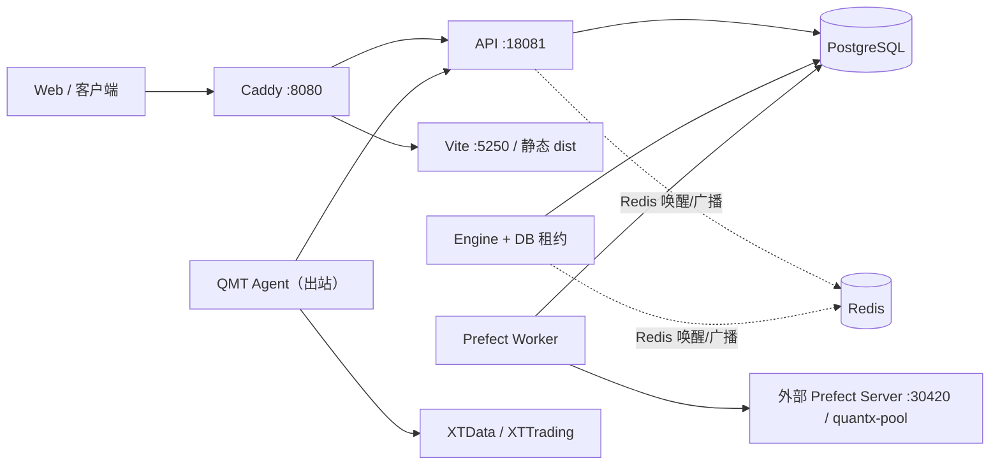

# QuantX Monorepo 运行架构

## 进程所有权

- Caddy 是唯一公开入口。
- API 只拥有 HTTP/GraphQL、认证、数据库会话、Agent Hub 和订阅桥接。
- Engine 独占策略管理器、清仓/做 T、热缓存、命令处理和回报收敛，并用
  PostgreSQL 租约保证单实例。
- Worker 独立运行 Prefect flows/tasks，不导入 QMT。
- QMT Agent 是唯一可访问 XTData/XTTrading 的进程，只依赖 contracts
  作为服务端共享包。

API 不启动或停止 Engine、Prefect、Worker 或 QMT Agent。任一组件重启都
从数据库消息箱和业务表恢复。

## 可靠通信

`trade_command_outbox`、`agent_report_inbox`、`market_data_request` 与
`market_data_transfer` 使用消息 ID、业务幂等键和唯一索引。Redis 只降低
唤醒延迟；数据库轮询是恢复路径。

## 部署

- 开发：`ops/quantx.ps1 up -Environment dev -Profile web|full`
- 本机生产：WinSW 分别监管 Caddy、API、Engine、Worker、QMT Agent。
- PostgreSQL、InfluxDB、Redis、Prefect Server 由外部管理，只做连接和版本检查。

更完整的系统边界见 [../../architecture/系统架构设计.md](../../architecture/系统架构设计.md)。
