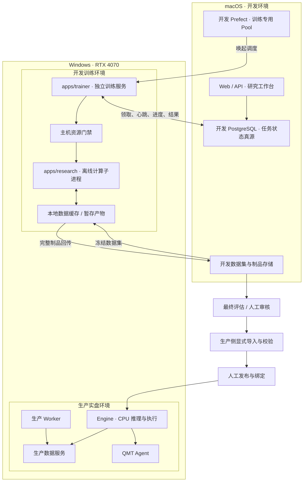

# 独立训练服务架构与实施方案

日期：2026-09-09

状态：实施中；训练调度代码已迁入 Trainer，运行端切换与部署验收尚未完成。

本文固化独立训练服务的设计结论。实施检查点不表示运行环境或 GPU 已验收；现有运行规则在正式切换前继续生效。

实施检查点（2026-09-10）：

- 当前状态：实现中。上次组合回归覆盖 Trainer 全部测试及直接相关主机门禁、Research GPU/CPU/CLI/准备/工作流，374 项通过，3 项 Windows Job Object 实测跳过。日志与摘要位于 `.runtime/trainer-deployment/regression-current.log`、`regression-current.json`；本地通过不表示 Windows/GPU 或跨机器验收完成。
- 生命周期与状态：独立配置/预检、serve/up/down、drain/resume、根运维入口及按运行/准备归属读取的脱敏日志已接入；Windows Job 包含、组退出证明和停止后数据库恢复已有实现。status 离线显示服务身份、启动代码证据、心跳、准入、全机资源及配置绑定的 CPU/GPU/任务快照。任务快照用单条只读查询，运行中优先，最多 50 条且显式截断；仅反映数据库状态，不证明进程存活或已排空。90 秒后隐藏旧资格与任务。最新查询/缓存/调度关联回归 33 项通过，含实际 SQLite 查询到文件快照与旧 Worker 测试；证据为 `.runtime/trainer-deployment/activity-status-tests.xml`。两类调度器现记录实际返回的稳定原因及开始/结束决定，状态按时间、配置和调度类型校验；46 项相关测试通过，证据为 `.runtime/trainer-deployment/dispatch-status-tests.xml`。空队列/运行上限的组合原因仍需细化；Windows 原生停止、残留进程、断联和数据库整链仍待验收。
- 数据与结果：Worker 导出冻结输入并交接，Trainer 认证/资格/训练及制品传输、回读、登记和恢复已接入。输入尝试及计算进程持久化身份，未确认退出不开放重试；恢复发布要求明确零退出码，保护退出不得凭遗留成功清单发布。本地合成行情完成冻结认证实际计算（两只股票、60 个交易日、120 条样本）；SFTP 有本地真实通道测试，尚无真实跨机器行情/训练闭环证据。新增 RESULT bundle→API run_id 目录的本地导入层，核对数据库成功状态/标识/哈希，完整校验后原子发布，开发 Worker 专用 research-result-import 调度已接入，分页导入并在取消时等待线程停止，已导入结果可离线复核。13 项导入/调度/登记整链测试通过，含真实目录 bundle→API 加载→SQLite 显式晋级；尚未部署 Prefect 或验收跨机器页面读取。模型登记已补齐成功 DEVELOPMENT 父运行及 manifest/metrics/数据库父关联一致性检查，真实制品加载器校验并保留父级证据。41 项相关测试通过，含合成制品实际加载、API 登记和 SQLite CANDIDATE→显式 SHADOW/ACTIVE、幂等登记及篡改拒绝；仍未验收跨机器导入与真实训练产物的发布整链。
- 资源门禁：全部高资源 CLI 共用主机锁、时段、CPU/RSS/内存/磁盘检查。LightGBM 训练、资格与微型 GPU 探针使用准入线程预算；status 已展示时段/全机内存/磁盘只读快照及配置预算，资源容量阈值与执行门禁共用，主机锁和计算进程预算不伪装已检查；回归证据为 `.runtime/trainer-deployment/host-status-tests.xml`。GPU 路径接入必填 `gpu_max_memory_fraction`，启动前及运行时检查，超限/读数未知有界停止，保护退出码 75 透传。真实 CPU 拟合验证两个线程且不探测 GPU，普通子进程注入显存超限验证协作/强制退出；4070 阈值及原生 GPU 消耗仍需实测。
- 部署输入：已重新固定 b41142f15f6ad904ed5784beca32dfb88ea1827e，打包并安全解包 2,897 个文件，离线导出 161 条严格锁定外部依赖（与旧清单摘要一致，无依赖升级）。新产物为 `.runtime/trainer-deployment/code-b41142f1`、`dependencies-b41142f1`，交接坐标与哈希见 `candidate-b41142f1.json`；旧 a6816564 包仅保留为历史证据。b41142f1 包不含后续状态展示改动，最终部署前仍需固定最终提交重新打包。六个工作区包已实际完成本地可编辑构建，构建后完整源码证据仍为干净状态，见 `workspace-build-b41142f1/result.json`；本地 wheel 含本机路径，仅验证、不部署，未安装到环境。
- 运行冻结：Windows 当前进程 ACL/危险权限预检已覆盖代码、Conda 全树及父目录替换；81 项相关测试通过，原生 ACL 测试待 Windows 执行。部署清单保留源码提交证据；训练结果与开发锁哈希覆盖 `source-evidence.json`，源码变更或父开发版本不一致拒绝执行。标准可编辑元数据识别及工作流回归 50 项通过。证据分别为 `.runtime/trainer-deployment/runtime-permissions-tests.xml`、`training-source-tests.xml`、`editable-source-tests.xml`；尚未完成运行账户/ACL 配置、升级前排空和实际冻结验收。
- 运行端：此前只完成 Windows 独立 quantx-train Conda 引导，未完成完整代码、依赖、显式配置、开发角色/迁移、专用 Prefect Pool 和受限 SFTP/网络部署。本次有界 SSH 探测仍超时，探测进程已结束，无远端安装/训练任务在本轮运行；未连接生产状态或执行真实交易。
- 剩余退出门：完成运行期间代码/依赖冻结及升级前排空约束，运行端完整部署，原生 Windows/GPU 与跨机器 CPU/GPU/故障验收，运行日志关联与状态展示的完整核验，阶段 5 的隔离制品导入/校验/登记/显式绑定，以及阶段 6 的旧部署排空和原子切换。正文各阶段、验收项及关联文档同步要求全部保留；不能以已有单测、源码包或预检替代运行端验收。

## 1. 目标与架构决策

正式新增 `apps/trainer` 独立训练服务，部署在配备 RTX 4070 的 Windows 上。macOS 承担开发控制面和轻量研究，Windows 开发训练与生产实盘使用独立代码目录、依赖、配置、数据权限及生命周期。

- Trainer 管理训练和高资源研究任务的完整执行生命周期。
- `apps/research` 保留离线计算实现和 CLI，作为 Trainer 管理的任务子进程运行。
- `apps/worker` 保留行情同步、补数及其他通用后台任务，迁移完成后不再领取训练任务或管理 GPU。
- 复用现有 Web/API、数据库任务契约和 Prefect，不新增训练 HTTP API。
- 从第一阶段建立正式应用边界，不先借用通用 Worker 部署再二次拆分。
- 单机单 GPU 为当前部署规模；不预建多租户、动态节点发现、分布式训练或 GPU 集群。

实施可以分阶段，目标架构保持一致。服务与契约不绑定具体机器路径，未来迁移计算节点或开发控制面不需要改变业务职责。

## 2. 服务与进程的定义及当前状态

进程是操作系统执行单位，服务是架构和运维职责单位。一个服务可以包含多个进程，并为每次任务启动短生命周期子进程。

QuantX 将满足下列条件的组件视为独立服务：

| 维度 | 判定标准 |
| --- | --- |
| 职责 | 持续提供明确能力，具有稳定职责边界 |
| 接口 | 通过 HTTP、队列或数据库任务协议提供能力 |
| 生命周期 | 有独立启动、停止、重启入口，不由其他业务服务代管 |
| 部署 | 有明确运行入口、身份、配置和代码版本 |
| 故障处理 | 能识别不可用、收敛任务，故障不要求其他服务退出 |
| 可观测性 | 有独立心跳、状态、日志和任务记录 |

独立端口、独立数据库、独立机器、注册为 Windows Service 都不是必要条件。Conda 环境用于依赖隔离，也不单独构成服务边界。

当前 API、Engine、Worker、QMT Agent 都是独立服务。Research 是离线应用；训练由通用 Worker 领取任务并启动 Research 子进程，尚无专用训练服务部署边界。

当前实现依据：

- [Worker 入口](../../apps/worker/src/quantx_worker/main.py)：注册 Prefect 部署并启动 Worker。
- [训练调度与进程管理](../../apps/worker/src/quantx_worker/prefector/flows/stock_selection_training_flow.py)：领取数据库任务、使用 `Popen` 启动 Research；默认命令沿用 Worker 的 Python 解释器。
- [Research 应用说明](../../apps/research/README.md)：离线研究与计算应用。
- [训练工作台契约](../engineering/api/NEXT_DAY_SELECTION.md)：预检、训练、最终评估与模型登记语义。

## 3. 目标部署架构

macOS 的开发 PostgreSQL 与 Prefect 必须通过显式配置的受限局域网端点供 Trainer 访问。现有仅回环监听的开发配置不能直接满足跨机器使用；部署时只开放必要服务、限制来源与权限，不公开生产服务或无关开发端口。具体端口和凭据属于本机配置，不写入本文。

## 4. 代码与职责边界

| 位置 | 长期职责 |
| --- | --- |
| `apps/api` | 预检、提交、取消、查询，模型登记和发布入口；不执行重计算 |
| `apps/trainer` | 能力探测、领取、资源准入、子进程管理、取消、恢复、产物收敛 |
| `apps/research` | 数据集构建、特征计算、训练、评估、报告与离线 CLI |
| `apps/worker` | 行情下载、同步、补数和通用后台任务 |
| `apps/engine` | 验证并加载已发布模型，执行 CPU 推理与交易 |
| `packages/contracts` | 训练请求、进度、结果、制品清单和版本契约 |
| `packages/application` | 训练用例、生命周期规则及端口 |
| `packages/infrastructure` | 任务仓储、传输和存储适配器 |

Trainer 通过版本化命令与文件契约调用 Research，不导入其内部实现。可复用逻辑按实际职责进入共享包，不复制训练代码，不引入应用间循环依赖。交易 domain 继续保持纯交易域边界，不承载调度、文件传输或 GPU 实现。

现有训练调度、能力心跳、子进程管理及恢复逻辑迁入 Trainer。研究准备任务按职责拆分：行情下载和补数留在 Worker；冻结数据集构建、认证、特征计算、GPU 资格验证进入 Trainer。准备阶段产物经持久化状态交接，不能让两侧同时拥有同一任务。

## 5. 环境与权限

| 项目 | macOS 开发控制面 | Windows 开发训练 | Windows 生产实盘 |
| --- | --- | --- | --- |
| 代码 | 开发目录 | 独立训练代码目录 | 生产目录 |
| Conda | `quantx` | 新增 `quantx-train` | 保留既有环境 |
| 数据库 | 独立开发库 | 仅开发库必要研究表权限 | 生产库 |
| Prefect | 开发 Server | 开发 Server 专用训练 Pool | 生产 Server |
| 文件 | 开发数据与制品 | 独立缓存、控制目录和暂存产物 | 生产运行目录 |
| 交易权限 | 关闭 | 关闭，无券商配置和设备密钥 | 既有实盘门禁 |
| GPU | 无要求 | 经资格验证后使用 4070 | Engine 不依赖 GPU |

Trainer 必须显式加载开发配置，并在建立连接和领取任务前校验环境与目标。配置缺失或不匹配时启动失败，不回退生产默认值。仓库入口参数与应用内部环境值使用统一映射，不自行发明另一套环境枚举。

训练代码更新和依赖安装不得修改生产目录及生产 Conda 环境。任务执行期间冻结代码与依赖版本；升级前排空任务，不能在运行中替换子进程所读取的代码。

落实时同步修改当前“Windows 为 production”及共用 `quantx` 的规则，明确 Windows 可承载显式隔离的开发训练部署；生产主链默认行为保持原有约定。

## 6. 数据、调度与结果闭环

1. 历史行情通过受控导出进入开发侧。冻结数据集记录版本、时间范围、字段、文件大小与哈希；训练不直接读取生产业务库。
2. Trainer 按数据集标识传输至 Windows 本地缓存，完整校验后才可使用。训练读取本地完整文件，不跨网络逐批扫描。
3. API 预检数据、节点能力和参数，冻结数据版本、代码版本、依赖证据、种子、切分、后端与资源预算，幂等创建任务。
4. 专用 Prefect Pool 唤起训练调度。Trainer 通过数据库原子领取、资源门禁后启动 Research。
5. Research 写入阶段进度与结果，Trainer 更新心跳并处理取消。
6. Trainer 校验产物、回传开发侧并登记可读引用。全部必需产物完整可读后才标记成功。

开发 PostgreSQL 是任务状态真源；Prefect 是调度器；进程与本地文件是执行证据。Prefect 成功、进程退出码为零或存在单个模型文件都不等同于训练成功。

文件传输采用受限通道，优先验证 SFTP 等现成机制，不新增自建存储平台。通道只能访问指定目录，按数据集或制品标识寻址，采用临时上传、哈希校验和原子完成。macOS 本地路径不能作为 Windows 执行参数；UI 不接受任意服务器路径。

数据集缓存可按引用与容量策略清理，但运行中引用的数据、未回传的产物及诊断证据不能自动删除。数据库登记与文件写入通过可重试收敛衔接，不假设跨数据库、文件系统存在原子事务。

## 7. 主机资源与实盘保护

独立服务提供软件边界，不提供物理资源完全隔离。训练、特征生成、数据认证和 GPU 资格测试共用主机级资源准入：

- 同机最多一个高资源任务；CPU 与 GPU 任务均纳入限制。
- 仅在显式允许的训练窗口执行，避开连续交易和盘后关键数据任务。
- 启动前检查资源，执行中持续检查预算和时间窗口。
- 到保护窗口请求安全停止，超过宽限期终止并记录结果；不能只检查启动时间。
- 配置 CPU 线程、内存、显存、磁盘空间预算，数值依据本机验证确定。
- 门禁信息缺失、主机锁不明或资源不足时保持排队。

现有训练调度根据 Worker 自身是否处于 `full/live` 判断交易避让。新 Trainer 使用开发配置，必须改为独立于业务环境的主机级门禁，避免保护失效。

门禁使用本机配置、时间窗口和互斥机制，不要求读取生产数据库，也不另建常驻门禁服务。直接调用高资源 Research CLI 也必须经过同一准入入口，防止绕过并发和时段限制。

GPU 沿用现有后端与资格契约：显式 CPU 不初始化 GPU；GPU_REQUIRED 不满足资格时失败；AUTO 仅按已验证规则解析。不得在同一运行中静默更换后端。4070 存在不等于资格已通过，必须在 `quantx-train` 中重新验证构建、资源、数值及 CPU 加载证据。

## 8. 生命周期与恢复

| 场景 | 预期行为 |
| --- | --- |
| Trainer 离线或能力过期 | 展示不可用，阻止启动新任务 |
| 开发控制面断联 | 不领取新任务，运行任务在安全点停止，本地保留证据 |
| Trainer 重启 | 核对持久化归属、心跳与可验证进程身份，收敛遗留任务 |
| Research 崩溃 | 失败并保留脱敏日志和不完整产物 |
| 制品回传失败 | 保留本地产物，重试传输，不重复训练 |
| 重复投递 | 幂等创建和原子领取阻止重复执行 |
| 取消与完成竞争 | 通过状态版本检查收敛唯一结果 |
| 生产服务重启 | 不代管 Trainer 生命周期 |
| Trainer 重启 | 不操作生产 API、Engine、Worker 或 QMT |

任务状态持久化运行归属和心跳；进程身份不能仅凭 PID 或进程内字典判断。恢复必须先排除仍存活的旧计算，再允许新任务取得主机资源。失去任务所有权的执行者不能写入成功结果。

具体状态枚举以现有契约为基础，只为真实新增语义扩展。任何扩展在数据库、服务、客户端、文档和测试中原子切换，不增加默认双协议兼容。

不承诺任意训练都能断点续算。只有算法具备可靠检查点时才恢复计算；否则结束原运行，创建有明确关联的新尝试。

当前控制面部署在 macOS，训练期间需要其保持在线。若后续需要合盖后无人值守训练，可将开发控制面迁往常开设备，复用本方案的远程契约；本次不额外部署第二套开发控制面。

## 9. 模型跨环境发布

发布链路固定为：DEVELOPMENT → FINAL_EVALUATION → 人工审核 → 生产导入校验 → 登记 → 人工发布与绑定。

发布包包含：

- 模型及文件哈希；
- 数据集、特征、标签和评估版本；
- 代码、依赖、随机种子及训练后端证据；
- 最终评估结果和门禁结论；
- 制品格式与 CPU 加载、推理兼容性证据。

生产重新校验包的完整性和兼容性，再创建自己的登记记录。禁止通过复制开发数据库记录、本地路径或 ACTIVE 状态实现上线。Trainer 不持有生产写权限，导入由生产侧授权操作执行。

Engine 只加载显式发布和绑定的不可变制品，不依赖训练服务在线，不通过逐 Tick RPC 请求训练服务推理。

## 10. 运维与可观测性

Trainer 纳入 `ops/quantx.ps1` 统一运维体系，新增独立启动、停止、状态、日志能力。命令参数在实现时与现有入口统一；本文不将未实现命令列为可执行操作。

- 生产 `full` 启停默认不包含开发 Trainer。
- Trainer 停止操作负责其任务子进程的有界退出与状态收敛。
- 显示服务心跳、代码版本、后端资格、当前任务、资源门禁和排队原因。
- 日志关联运行标识，路径、连接信息和异常按现有规则脱敏。
- PostgreSQL、Prefect 等外部服务只检查，不自动启停。
- 不引入 WinSW、Kubernetes 或另一套发布安装体系。

## 11. 实施阶段与退出条件

| 阶段 | 交付与退出条件 |
| --- | --- |
| 1. 正式服务与最小闭环 | 创建 `apps/trainer`、独立 Conda、入口和训练 Pool；macOS 提交小型 CPU 任务，Windows 执行，结果回到开发页面；证明未连接生产资源 |
| 2. 数据与制品 | 冻结数据集传输、缓存、哈希、回传和登记形成完整闭环，明确生产导入格式 |
| 3. 可靠性与资源门禁 | 验证取消、断联、重启、重复投递、孤儿进程、时段、全机并发和预算 |
| 4. GPU | 在独立环境验证 4070 后端资格、资源消耗及 CPU 推理兼容性 |
| 5. 发布链路 | 在隔离测试配置验证制品导入、校验、登记和显式绑定，不执行真实交易 |
| 6. 原子切换 | 排空旧运行，从通用 Worker 移除训练部署，切换到 Trainer，同步规则、契约、客户端、测试与文档 |

新旧调度器不能同时领取同一训练任务。历史结果保留；如需数据结构变化，提供明确迁移，不依赖长期双写或兼容层。试运行使用隔离开发任务，正式切换前完成必要检查。

## 12. 验收与关联文档

必要验收：

- Trainer 可独立启停，API、Engine、QMT 不受其进程生命周期影响。
- 环境配置缺失、错连生产目标或权限越界会在领取前拒绝。
- 跨机器 CPU 与合格 GPU 训练均能完成数据、任务、进度和制品闭环。
- 断网、进程丢失、取消竞争和重复投递不会产生重复执行或虚假成功。
- 所有高资源入口受同一主机门禁约束，开发配置不能绕过实盘时段保护。
- 制品完整性、最终评估和人工发布门禁不能被训练成功绕过。
- 修改后先运行受影响单测，必要时验证受控跨机器集成链路；普通测试不连接生产状态、不执行真实交易。
- GraphQL/schema/查询变更使用 `quantx-graphql-codegen` 技能和实际运行端 Caddy 验证，完成项目要求的客户端检查。

实施时同步更新以下规则和文档，不以本文代替已经生效的运行说明：

- 根目录 `AGENTS.md`：Windows 开发训练身份、Conda、Trainer 职责及运维边界。
- [系统架构设计](../architecture/系统架构设计.md)。
- [部署说明](../engineering/deployment/README.md)。
- [Windows LightGBM GPU 训练](../engineering/deployment/LIGHTGBM_GPU.md)。
- [次日选股训练工程文档](../engineering/api/NEXT_DAY_SELECTION.md)。
- [现有模型训练与 GPU 实施计划](次日上涨概率网页模型训练与GPU加速实施计划.md)。
- [多标的做 T 架构设计](../architecture/多标的做T助手新架构设计.md)中的训练、资源和发布边界。
