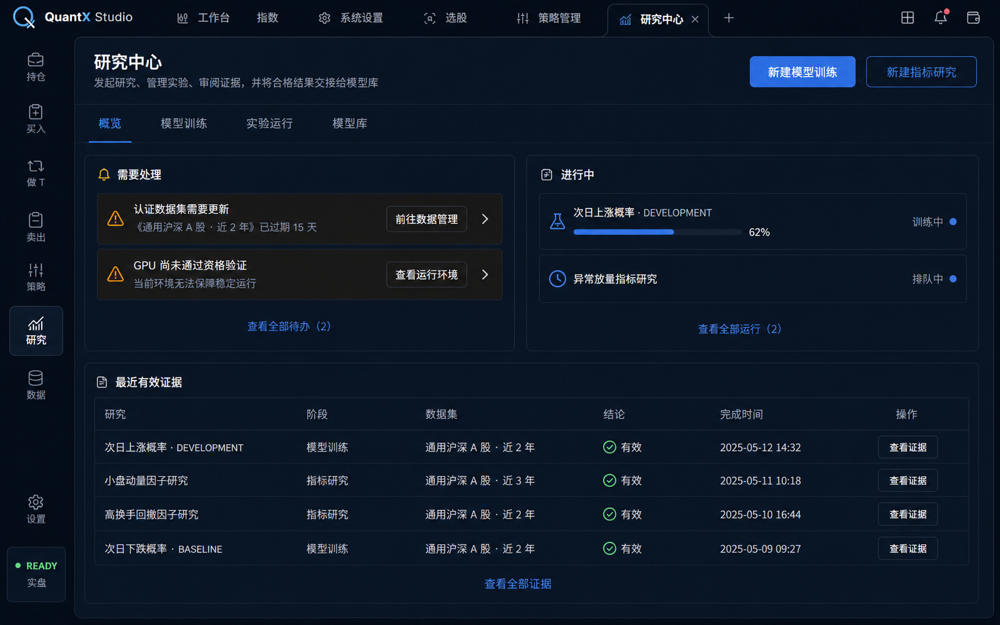
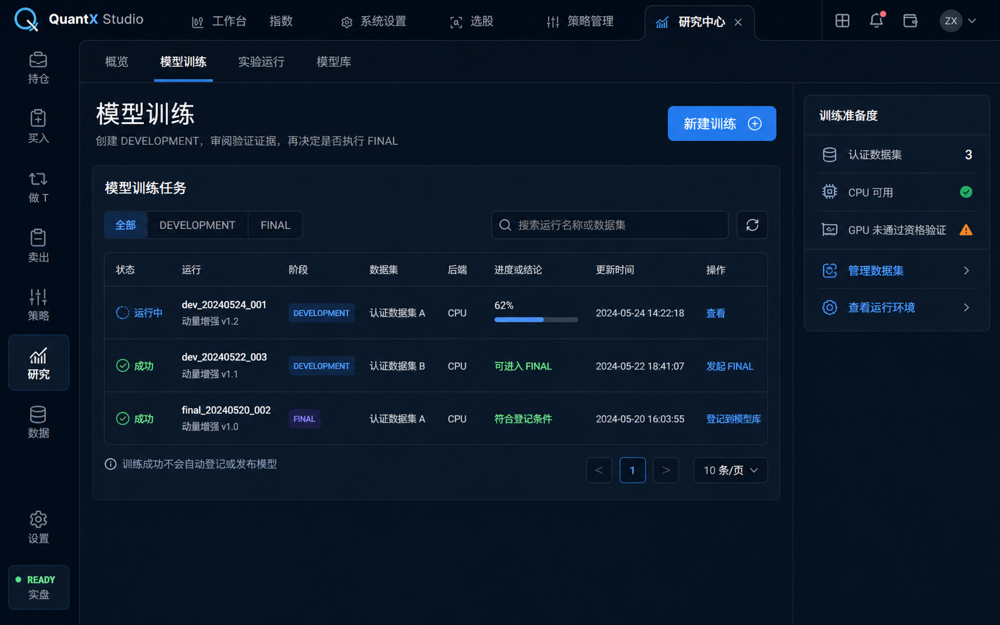
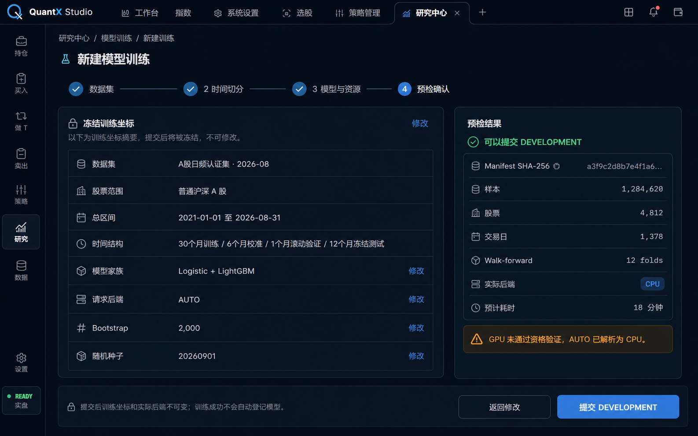

# QuantX 研究中心全生命周期中枢界面重构实施计划

> 状态：产品职能与桌面视觉方向已批准，代码实施待开始  
> 批准日期：2026-09-02  
> 适用范围：apps/web 研究中心及其直接使用的 GraphQL 契约  
> 关联计划：[次日上涨概率网页模型训练与 GPU 加速实施计划](./次日上涨概率网页模型训练与GPU加速实施计划.md)

## 1. 目标

### 1.1 用户问题

当前 /research 首屏同时承担模型登记、新建训练、CPU/GPU 环境状态、训练运行
队列、FINAL 对比和历史研究浏览。页面存在两套运行列表、多个语义相同的刷新入口，
并把模型登记放在训练之前。用户进入页面后无法判断下一步应当发起研究、处理失败
任务、查看证据还是发布模型。

### 1.2 产品定位

研究中心是 QuantX 的研究全生命周期中枢：

> 发起研究、管理实验、审阅证据、比较结果，并将合格模型交接给策略系统。

它不负责认证数据生产、GPU 运维、策略实例管理或交易执行。

### 1.3 成功标准

1. 用户进入研究中心后，能立即看到需要处理的问题、进行中的任务和主要创建入口。
2. “模型训练”作为固定二级导航和概览快捷入口，不隐藏在历史列表或模型登记表单中。
3. 四步训练向导使用独立页面，不与历史列表、模型库和运行详情争夺首屏。
4. 所有研究类型在“实验运行”中使用唯一的统一列表，不再出现两套互相竞争的运行列表。
5. DEVELOPMENT、FINAL_EVALUATION、模型登记与阶段切换保持清晰的人工边界。
6. 页面不再要求用户复制或粘贴研究运行 key。
7. 标准和紧凑密度都遵守 QuantX 权威 UI/UX 设计系统。

## 2. 已冻结决策

| 决策         | 已批准方案                               | 原因                               |
| ------------ | ---------------------------------------- | ---------------------------------- |
| 研究中心定位 | 研究全生命周期中枢                       | 统一“创建—运行—证据—毕业”的任务链  |
| 职能分组     | 任务导向                                 | 新增研究类型时不增加顶层导航噪声   |
| 固定二级导航 | 概览、模型训练、实验运行、模型库         | 同时保持训练入口可见和运行列表统一 |
| 模型训练入口 | 固定二级导航 + 概览主快捷按钮            | 高频且高价值，不应藏在类型选择器中 |
| 概览职责     | 新建研究、进行中、需要处理、最近有效证据 | 帮助用户决定现在做什么             |
| 实验运行     | 所有研究类型共用一张权威列表             | 消除当前两套运行列表               |
| 模型库归属   | 研究中心内管理证据和阶段                 | 策略模块只消费 ACTIVE 模型         |
| 视觉流程     | 先审批三张桌面预览，再实施               | 信息架构重构必须先确认层级         |
| 预览审批     | V01、V02、V03 全部通过                   | 2026-09-02 用户明确批准            |

## 3. 职能边界

| 能力                             | 权威归属              | 研究中心中的表现                         |
| -------------------------------- | --------------------- | ---------------------------------------- |
| 认证数据集创建、更新和质量治理   | 数据管理              | 只展示准备度、选择数据集并链接到数据管理 |
| CPU/GPU 安装、驱动和资格验证     | 系统运行环境          | 只展示脱敏能力摘要和问题解决入口         |
| 研究配置与服务端预检             | 研究中心              | 新建研究或模型训练向导                   |
| 排队、运行、取消、失败和完成     | 研究中心              | 实验运行与运行详情                       |
| 质量报告、稳定性和同坐标对比     | 研究中心              | 运行详情和证据比较                       |
| FINAL 模型登记和阶段流转         | 研究中心模型库        | CANDIDATE、SHADOW、ACTIVE 人工操作       |
| 策略实例、每日推理消费和交易执行 | 策略、Engine 与交易域 | 只消费 ACTIVE 模型，不在研究中心启用交易 |

研究中心不得恢复以下交互：

- 在首屏粘贴运行 key 登记模型；
- 训练成功后自动登记或发布；
- GPU 失败时在同一运行中静默切换 CPU；
- 在表单中自由编辑高级 JSON、标签版本或单个 walk-forward fold；
- 用前端拼接两个独立分页结果并声称得到全局有序的统一运行列表。

## 4. 信息架构与路由

    研究中心
    ├─ 概览
    ├─ 模型训练
    │  ├─ 新建训练
    │  └─ 训练运行详情
    ├─ 实验运行
    │  └─ 研究证据详情
    └─ 模型库

| 路由                                    | 页面         | 说明                                     |
| --------------------------------------- | ------------ | ---------------------------------------- |
| /research                               | 研究概览     | 下一步行动、进行中、待处理和最近有效证据 |
| /research/training                      | 模型训练     | 训练任务过滤视图与训练准备度             |
| /research/training/new                  | 新建模型训练 | 独立四步向导                             |
| /research/training/runs/:runId          | 训练运行详情 | 阶段进度、错误、取消、FINAL 和登记入口   |
| /research/runs                          | 实验运行     | 跨研究类型的权威统一列表                 |
| /research/:studyId/:version/runs/:runId | 研究证据详情 | 保留现有签名 key 读取路径和深链接        |
| /research/models                        | 模型库       | FINAL 证据、模型版本和阶段流转           |

现有研究结果深链接必须继续工作。新增页面通过 Studio 工作区标签打开，不创建第二套
全局导航壳层。

## 5. 页面计划

| ID  | 路由                           | 目的                   | 主要组件                                                     | 关键状态                                                           | 数据与 API                                                                                                                               | 入口与出口                                           | 预览                     |
| --- | ------------------------------ | ---------------------- | ------------------------------------------------------------ | ------------------------------------------------------------------ | ---------------------------------------------------------------------------------------------------------------------------------------- | ---------------------------------------------------- | ------------------------ |
| P01 | /research                      | 告诉用户现在需要做什么 | 页面标题、二级导航、创建按钮、需要处理、进行中、最近有效证据 | 加载、无待办、无运行、局部错误、正常                               | ResearchRuns、StockSelectionTrainingRuns、StockSelectionTrainingCapabilities、StockSelectionDatasetVersions                              | 左侧“研究”；进入训练、运行、证据、数据管理和环境详情 | V01                      |
| P02 | /research/training             | 模型训练固定工作区     | 标题、新建训练、阶段筛选、训练任务表、训练准备度             | 无认证数据集、CPU 可用、GPU 不合格、空列表、运行中、失败、成功     | StockSelectionTrainingRuns、StockSelectionTrainingCapabilities、StockSelectionDatasetVersions                                            | 概览快捷入口；进入向导、运行详情、数据管理和环境详情 | V02                      |
| P03 | /research/training/new         | 创建一次 DEVELOPMENT   | 面包屑、四步指示器、步骤表单、预检证据、提交栏               | 数据加载、字段校验、预检中、阻断、警告、可提交、提交失败、幂等重试 | StockSelectionDatasetVersions、StockSelectionTrainingCapabilities、PreviewStockSelectionTraining、StartStockSelectionDevelopmentTraining | 模型训练；提交后进入训练运行详情                     | V03                      |
| P04 | /research/training/runs/:runId | 管理训练生命周期       | 运行摘要、阶段进度、错误原因、质量结论、证据摘要、操作栏     | 排队、运行、取消请求、取消、失败、DEVELOPMENT 成功、FINAL 成功     | StockSelectionTrainingRun、StartStockSelectionFinalEvaluation、CancelStockSelectionTrainingRun、RegisterStockSelectionModel              | 训练列表或实验运行；进入证据详情、模型库             | V03 的视觉语言           |
| P05 | /research/runs                 | 唯一实验运行索引       | 搜索、类型/阶段/状态/日期筛选、统一表、分页                  | 加载、空结果、局部错误、刷新、分页                                 | 需要新增权威统一连接，见第 8 节                                                                                                          | 概览、训练页；进入对应运行详情                       | V02 的表格语言           |
| P06 | /research/models               | 管理研究毕业后的模型   | 模型表、阶段筛选、证据摘要、阶段操作、审计信息               | 空库、CANDIDATE、SHADOW、ACTIVE、门禁阻断、版本冲突、权限不足      | StockSelectionModels、RegisterStockSelectionModel、SetStockSelectionModelStage                                                           | 概览或 FINAL 详情；策略模块只读取 ACTIVE             | V02 的表格与右侧详情语言 |
| P07 | 现有研究详情路由               | 阅读结构化研究证据     | 现有指标、曲线、回归、稳健性和来源面板                       | 现有加载、错误、空产物和成功状态                                   | ResearchRun                                                                                                                              | 实验运行；返回实验运行而不是旧首屏长表               | 沿用现有页面             |

## 6. 页面内容与交互

### 6.1 研究概览

首屏顺序固定为：

1. 页面标题、二级导航和两个创建入口；
2. “需要处理”和“进行中”并列；
3. “最近有效证据”紧凑表格。

“需要处理”只展示有明确解决动作的事项，例如认证数据集缺失、能力快照过期、
训练失败或 FINAL 待审。每一项必须提供下一步链接，不展示不可操作的警报墙。

概览不得展示完整历史列表、模型登记输入框、同坐标对比器或完整训练表单。

### 6.2 模型训练

页面主体是模型训练任务表，固定提供全部、DEVELOPMENT 和 FINAL 过滤视图。
右侧“训练准备度”只显示：

- 认证数据集数量；
- CPU 是否可用；
- GPU 资格状态；
- 数据管理与运行环境入口。

新建训练是唯一主按钮。没有认证数据集或 CPU 不可用时，按钮禁用并显示具体解决
入口。GPU 不合格不阻止 CPU 训练，但 GPU_REQUIRED 必须继续被服务端预检阻断。

训练成功不会自动登记或发布模型，这一边界在任务表底部以短说明持续可见。

### 6.3 新建模型训练

四步分别为：

1. 数据集；
2. 时间切分；
3. 模型与资源；
4. 预检确认。

步骤一至三只展示当前步骤的必要输入，不把所有字段一次性铺开。步骤四使用
“冻结训练坐标 + 预检结果”双栏布局，必须显示：

- 解析后的数据集版本和 manifest SHA-256；
- 股票范围、总区间和权威时间结构；
- 模型家族与请求后端；
- 样本、股票、交易日和 fold 数；
- 实际后端、资源与耗时估算；
- blocker、warning 和只能 SHADOW 的原因；
- 提交后坐标和实际后端不可变；
- DEVELOPMENT 成功不等于模型登记成功。

主按钮始终使用蓝色普通交互语义，不使用行情红绿。预检成功使用系统成功绿，
阻断使用危险色，GPU 降级说明使用警告琥珀色。

### 6.4 训练运行详情

运行详情负责完整生命周期操作：

    DEVELOPMENT 成功
      → 用户审阅验证证据
      → 发起 FINAL_EVALUATION
      → 用户审阅冻结测试证据
      → 登记到模型库

FINAL 和登记按钮只在服务端返回的门禁允许时出现。登记 mutation 使用当前 FINAL
运行返回的 runKey，由页面内部传递；不得要求用户复制粘贴。

### 6.5 实验运行

这是全产品唯一的研究运行索引。最低筛选维度：

- 研究类型；
- 生命周期阶段；
- 状态；
- 日期范围；
- 运行标识或数据集搜索。

列表最低字段：

- 状态；
- 研究；
- 阶段；
- 数据集或版本；
- 后端；
- 进度或结论；
- 完成/更新时间；
- 操作。

模型训练页可以显示该列表的模型训练过滤视图，但不得维护第二套展示规则。

### 6.6 模型库

模型库只管理已经具备 FINAL 证据的模型版本。它负责：

- 展示模型版本、训练运行、家族、时间范围和核心门禁；
- 登记 CANDIDATE；
- 人工切换 CANDIDATE、SHADOW 和 ACTIVE；
- 展示 approvedBy、approvedAt 和 stateVersion 审计字段；
- 清楚显示最多 1 ACTIVE / 2 SHADOW 的约束。

策略实例创建、每日推理和交易权限不进入模型库。

## 7. 跨页面流程与失败路径

### 7.1 正常流程

    数据管理认证数据集
      → 新建 DEVELOPMENT
      → 服务端预检
      → Worker 排队和训练
      → 审阅 DEVELOPMENT 证据
      → 发起 FINAL_EVALUATION
      → 审阅 FINAL 证据
      → 登记 CANDIDATE
      → 人工切换 SHADOW / ACTIVE
      → 策略系统消费 ACTIVE

### 7.2 数据集缺失

概览和模型训练页展示同一问题语义，链接到数据管理。向导不允许使用未认证数据集，
也不提供上传自定义数据的入口。

### 7.3 GPU 不可用

能力摘要显示真实状态和更新时间。AUTO 可由预检解析为 CPU；GPU_REQUIRED 被阻断。
任务创建后不在同一运行中静默切换后端。

### 7.4 预检失效

用户修改任何冻结坐标后，旧 previewFingerprint 立即失效，必须重新预检。提交遇到
版本冲突或预览失效时，页面保留表单并提示重新预检，不重复创建运行。

### 7.5 取消与失败

取消必须使用 expectedVersion 和幂等 key。运行失败展示服务端 errorCode、
errorMessage、失败阶段和可执行的重试方向，不以“未知错误”覆盖已有证据。

### 7.6 统一运行查询失败

实验运行页使用独立错误与重试状态；概览的局部查询失败不得让整个研究中心变成空白。

## 8. API 集成图

以下名称均来自当前仓库已有 GraphQL 文档，不是预览虚构接口。

| API | 当前操作                               | 消费页面               | 使用字段/行为                                    | 状态                   |
| --- | -------------------------------------- | ---------------------- | ------------------------------------------------ | ---------------------- |
| A01 | ResearchRuns                           | 概览、现有研究详情入口 | 最近研究、状态、时间、事件数、产物错误           | 已验证                 |
| A02 | ResearchRun                            | 研究证据详情           | 指标报告、数据质量、曲线、回归、稳健性和来源     | 已验证                 |
| A03 | StockSelectionTrainingCapabilities     | 概览、模型训练、向导   | CPU、GPU、fresh、更新时间、资格证据和环境摘要    | 已验证                 |
| A04 | StockSelectionDatasetVersions          | 概览、模型训练、向导   | 认证状态、日期、范围、版本、manifest、样本与质量 | 已验证                 |
| A05 | PreviewStockSelectionTraining          | 向导                   | 指纹、fold、覆盖率、泄漏、资源估算、后端、门禁   | 已验证                 |
| A06 | StockSelectionTrainingRuns             | 概览、模型训练         | 训练运行、阶段、进度、数据集、后端、结论和错误   | 已验证                 |
| A07 | StockSelectionTrainingRun              | 训练运行详情           | 单运行完整生命周期状态                           | 已验证                 |
| A08 | StockSelectionTrainingComparison       | 训练运行详情或比较面板 | 同坐标可比性、mismatch、指标和门禁               | 已验证                 |
| A09 | StartStockSelectionDevelopmentTraining | 向导                   | previewFingerprint 与幂等创建                    | 已验证                 |
| A10 | StartStockSelectionFinalEvaluation     | 训练运行详情           | 从成功 DEVELOPMENT 创建 FINAL                    | 已验证                 |
| A11 | CancelStockSelectionTrainingRun        | 训练运行详情           | expectedVersion 与幂等取消                       | 已验证                 |
| A12 | StockSelectionModels                   | 模型库                 | 模型版本、阶段、证据、门禁、审批与版本           | 已验证                 |
| A13 | RegisterStockSelectionModel            | FINAL 运行详情、模型库 | 由页面内部提交 runKey                            | 已验证                 |
| A14 | SetStockSelectionModelStage            | 模型库                 | 阶段、expectedVersion 与审批结果                 | 已验证                 |
| G01 | 跨研究类型统一运行连接                 | 实验运行               | 全局排序、过滤、分页和类型特定摘要               | 未解决，实施前必须设计 |

现有操作位置：

- apps/web/src/features/research/hooks/queries.gql
- apps/web/src/features/screening/hooks/probability.gql
- apps/web/src/features/research/hooks/useStockSelectionTraining.ts
- apps/web/src/features/research/hooks/useResearch.ts

### 8.1 G01 契约要求

当前 ResearchRuns 和 StockSelectionTrainingRuns 分别分页。前端不能把两个分页结果
拼接后声称拥有正确的全局排序、总数和翻页语义。

下一开发会话必须先选择并实现一个权威 GraphQL 连接，其契约至少包含：

- 稳定游标或全局 offset/limit；
- 统一的研究类型、阶段、状态和时间过滤；
- 可全局排序的 requestedAt、startedAt、completedAt 或 updatedAt；
- 通用运行身份和详情路由目标；
- 类型特定摘要的显式联合或可辨识字段；
- total 与分页语义；
- 权限、错误和空结果行为。

具体 GraphQL 字段名不得由本文凭空确定。实现时必须同步 schema、resolver、策略、
前端查询、生成类型、文档契约和测试，并使用 quantx-graphql-codegen 技能。

## 9. 设计系统

### 9.1 导航与布局

- 保留现有 QuantX Studio 顶部标签栏和左侧主导航。
- 研究中心使用页面内固定二级导航：概览、模型训练、实验运行、模型库。
- 页面 Frame 只有一个主滚动责任；表格可拥有明确的数据区域滚动。
- 1280px 及以上使用双栏概览和训练准备度侧栏。
- 1024–1279px 将侧栏移到主表上方，不隐藏信息或制造水平页面滚动。
- 产品是桌面 Studio，不在本次范围内创建新的移动导航；窄窗口仍需保持可读和可滚动。

### 9.2 密度与视觉

- 同时支持 standard 和 compact 密度。
- 使用现有 Inter 与等宽数字字体，不新增 Fira 或展示字体。
- 背景和面板使用现有 #050B16、#0B1728、#0F1D30 层级。
- 普通导航、选中、链接和主按钮使用蓝色交互语义。
- 红绿只表达 A 股事实；系统成功、警告和阻断分别使用现有状态语义。
- 面板圆角 6–8px，间距以 4px 基数和现有 Token 为准。
- 普通工作台面板不使用大阴影、玻璃拟态、渐变、发光或营销式 Bento 卡片。
- 图标复用现有 Lucide 集，不使用 emoji。

### 9.3 无障碍

- 标题层级连续；
- 所有输入有真实 label，placeholder 不是唯一标签；
- 状态使用图标、文字和颜色共同表达；
- Tab 顺序与视觉任务顺序一致；
- 所有可交互元素有 focus-visible；
- 多步流程显示当前步骤和完成步骤；
- 加载使用骨架或局部进度，空状态提供下一步动作；
- 动效限制在 150–300ms，并尊重 reduced motion。

## 10. 已批准视觉物料

预览是视觉方向，不是精确文案、数据或像素契约。具体内容以本计划和真实 API 为准。

### V01：研究概览

- 文件：docs/plans/assets/research-center-lifecycle/research-overview-approved.png
- SHA-256：D46C3676E44F7B3731F6B26E415913FB663B6E240DFE3B57C21B7B3E397CFDE4
- 批准重点：任务导向首屏、双创建入口、待处理、进行中、最近有效证据。

### V02：模型训练

- 文件：docs/plans/assets/research-center-lifecycle/model-training-approved.png
- SHA-256：37A78C542693267730B52D4F6F50ABDFED4BE137F0DD87E21BCCEC7195D97D02
- 批准重点：固定二级入口、单一新建按钮、训练表格和准备度侧栏，不内嵌向导。

### V03：新建训练预检确认

- 文件：docs/plans/assets/research-center-lifecycle/new-training-preflight-approved.png
- SHA-256：38B2BA946E197ADBE2C3E699BD2D7E27C0A4635DC9B975DC9EE32C8930AEC5D4
- 批准重点：独立四步向导、冻结坐标与预检双栏、单一 DEVELOPMENT 提交动作。

## 11. 实施顺序

### 阶段 A：路由与研究中心外壳

1. 提取研究中心二级导航和公共页面 Frame。
2. 注册概览、模型训练、实验运行和模型库路由。
3. 保留现有研究详情深链接与 Studio 标签行为。
4. 为标准和紧凑密度添加导航与 Frame 测试。

完成标志：四个页面入口可导航，现有研究详情链接不回归。

### 阶段 B：概览与模型训练页

1. 将现有 ResearchCenterPage 收敛为任务导向概览。
2. 把训练任务表与能力摘要迁移到 /research/training。
3. 删除首屏 SelectionModelRegistry 和内嵌 StockSelectionTrainingWorkbench。
4. 实现数据集缺失、能力过期、GPU 不合格和局部查询错误状态。

完成标志：首页不再出现运行 key 输入框、完整向导或两套列表。

### 阶段 C：独立训练向导与运行详情

1. 把 StockSelectionTrainingWorkbench 拆为步骤状态、步骤页面、预检摘要和提交栏。
2. 新增 /research/training/new。
3. 新增训练运行详情路由，承接取消、FINAL、比较和登记。
4. 保留稳定幂等 key、预览指纹和 expectedVersion 语义。

完成标志：用户可从模型训练页完成 DEVELOPMENT → FINAL → 登记的人工闭环。

### 阶段 D：统一实验运行契约

1. 先解决 G01，不允许前端假分页。
2. 完成 GraphQL schema、resolver、策略、生成类型、文档和测试的原子切换。
3. 实现实验运行统一筛选、排序、分页和详情路由。
4. 模型训练页复用相同的行展示规则或类型化视图模型。

完成标志：产品中只有一个权威实验运行索引。

### 阶段 E：模型库

1. 将 SelectionModelRegistry 重构为模型库页面。
2. 从 FINAL 详情直接传递 runKey 登记，不再提供自由文本输入。
3. 实现阶段门禁、版本冲突、权限不足和审计字段展示。
4. 保留最多 1 ACTIVE / 2 SHADOW 及人工审批边界。

完成标志：模型库可完成受控人工流转，不包含策略或交易控制。

### 阶段 F：清理、文档与浏览器验收

1. 删除旧首屏重复容器、重复刷新和不再使用的组合状态。
2. 更新 API、Web 工程文档和 GraphQL 公共契约。
3. 运行完整前端验证和受影响 Python 测试。
4. 在 full/live Dev 中检查标准、紧凑和 1024/1440 宽度。
5. 对照 V01–V03 记录实现偏差和理由。

## 12. 预计文件影响

可能涉及但不限于：

- apps/web/src/router/routes.tsx
- apps/web/src/features/research/pages/ResearchCenterPage.tsx
- apps/web/src/features/research/pages/ 下新增页面
- apps/web/src/features/research/components/StockSelectionTrainingWorkbench.tsx
- apps/web/src/features/research/components/SelectionModelRegistry.tsx
- apps/web/src/features/research/hooks/queries.gql
- apps/web/src/features/research/hooks/useResearch.ts
- apps/web/src/features/research/hooks/useStockSelectionTraining.ts
- apps/web/src/features/screening/hooks/probability.gql
- apps/web/src/**tests**/features/research/
- apps/web/src/**tests**/router/
- apps/api/src/quantx_api/gqlapi/（仅 G01 需要）
- apps/docs/public/contracts/（GraphQL 契约变化时）
- docs/engineering/api/NEXT_DAY_SELECTION.md
- docs/engineering/web/UI_UX_DESIGN_SYSTEM.md（只有权威 Token 发生变化时）

不得为了匹配预览新建第二套颜色、控件或页面尺寸系统。

## 13. 验收标准

### 13.1 职能与导航

1. 左侧“研究”进入 /research 概览。
2. 二级导航固定显示概览、模型训练、实验运行、模型库。
3. 概览的“新建模型训练”进入 /research/training/new。
4. 模型训练页不显示内嵌四步向导。
5. 实验运行是唯一完整运行索引。
6. 模型库没有自由输入 runKey 的控件。

### 13.2 训练流程

1. 四步向导只允许认证数据集。
2. 预检完整展示冻结坐标、覆盖率、泄漏、资源、实际后端和门禁。
3. 修改坐标后必须重新预检。
4. DEVELOPMENT、FINAL 和登记保持独立人工动作。
5. GPU 状态真实、可解释且不静默降级。
6. 取消、重试和提交保持既有幂等与并发控制。

### 13.3 视觉与无障碍

1. 与 V01–V03 的页面层级和任务顺序一致。
2. 交互蓝色与金融红绿语义不混用。
3. standard 与 compact 密度均无溢出。
4. 1024px 和 1440px 桌面宽度可用。
5. 键盘焦点、label、标题层级、状态文本和 reduced motion 合格。
6. 浏览器控制台没有新增 error 或 warning。

### 13.4 工程验证

GraphQL/API 变化后必须执行：

    $env:CODEGEN_GRAPHQL_ENDPOINT="http://127.0.0.1:8080/graphql"
    npm run codegen
    npm run check
    npm run lint
    npm run test:run
    npm run build

还应运行受影响的 Python 单元测试、根边界测试、git diff --check，并通过标准
Windows Dev full/live 入口完成浏览器验收。不得使用 as any 掩盖契约不一致。

## 14. 审批日志

| 日期       | 物料                   | 决定     | 说明                                         |
| ---------- | ---------------------- | -------- | -------------------------------------------- |
| 2026-09-02 | 职能定位               | 批准     | 研究全生命周期中枢                           |
| 2026-09-02 | 导航方案               | 批准     | 任务导向；模型训练固定二级入口和概览快捷入口 |
| 2026-09-02 | 概览、运行、模型库职责 | 批准     | 采用推荐方案                                 |
| 2026-09-02 | V01、V02、V03          | 全部批准 | 实施时以页面计划和真实数据为权威             |

## 15. 下一会话开工清单

1. 先读根 AGENTS.md、本计划、UI_UX_DESIGN_SYSTEM.md 和 NEXT_DAY_SELECTION.md。
2. 检查当前工作树，保护与本任务无关的并行改动。
3. 读取 frontend-design-to-code；批准预览已冻结，不重复生成设计。
4. 若触及 GraphQL，读取 quantx-graphql-codegen 并先解决 G01。
5. 按阶段 A–F 实施；不要重新把模型登记、向导和两套列表塞回 /research。
6. 完成验证后对照三张预览记录偏差。
7. 按项目要求由专用 Git 子代理拆分并提交本次改动。
