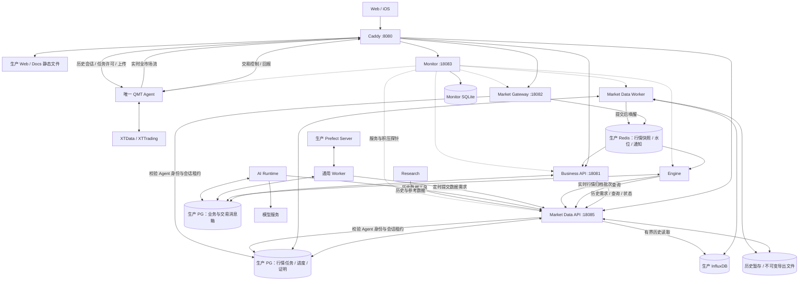
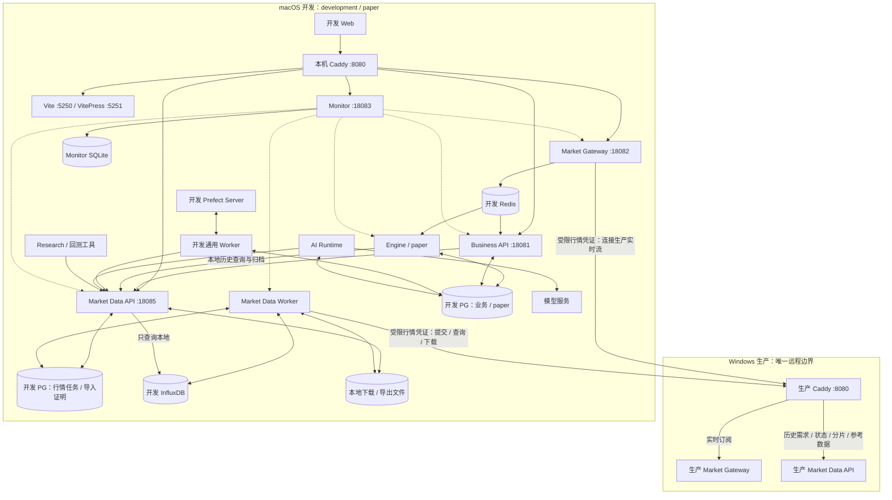
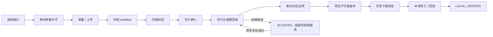

# 行情独立服务与补数可靠性整改方案

日期：2026-09-09。状态：待用户确认，本文是目标设计，不代表已实施或已恢复生产。

## 1. 决策摘要

将行情能力拆成独立业务服务，由三个进程组成：现有实时 Market Gateway、新增历史
Market Data API、新增常驻 Market Data Worker。两端使用同一套实现，生产使用 QMT
采集适配器，开发使用受限远程行情适配器和本地持久化数据。

生产和开发各自拥有 PostgreSQL、InfluxDB、Redis、Prefect。跨环境只允许行情 API
和实时流访问；开发不连接生产数据库、Redis、Prefect、账户控制面或 QMT。

历史业务统一由 Data Worker 推进，Prefect 仅定时提交持久化需求，不再承担逐分钟重启
摄取、轮询、重试和导出的职责。交易 Engine、业务 API、通用 Worker、AI Runtime
保留独立职责。唯一 QMT Agent 继续运行在 Windows 的 xtquant-demo 环境。

本方案同时解决当前回读失败、无效重试、全队列阻塞、进展不可见的问题。仅拆目录或
增加进程不能作为完成标准。生产恢复和开发导入分别验收，整体结案必须两端都通过。

## 2. 当前事实与诊断边界

本节来自本会话北京时间约 18:35—18:44 的生产只读检查，不是持续监控结果。

| 对象 | 已确认事实 |
| --- | --- |
| 50 个导出 | WAITING_SOURCE，各关联一个开发用途的源请求 |
| 50 个源请求 | 16:02—16:05 创建，全部 QUEUED，接收分片为零 |
| 请求范围 | Tick；9 月 1—4 日各 11 标的，9 月 7—8 日各 3 标的，共 50 分区 |
| 前置生产请求 | 98632b5b-24b0-4bcc-a178-792f2694dcab、d1cc696b-3e7d-446b-9842-39755db92268 |
| 上传 | 上述两个请求均 15/15 分片，分别约 15:16:14、15:17:34 完成上传 |
| 回读 | Worker 持续报 Query would scan 432 Parquet files, exceeding the file limit |
| 派发 | 两个 UPLOADED 占满每设备两个 in-flight 槽，后续请求停止派发 |
| QMT | READY，XTData CONNECTED，历史负载 idle，历史进度为空 |
| 调度 | 导出与摄取恢复 Flow 持续执行，不能把 Flow Completed 当作数据完成 |
| 历史失败 | 生产全表另有 11 个 INCOMPLETE；这不等于用户所选任务范围的 1 个失败 |

因果链为：生产回读查询失败 → 请求释放 claim 后仍为 UPLOADED → 原样重复摄取 →
占满有界暂存通道 → 生产及开发新增请求均无法派发 → 导出持续等待。

尚未确定实际失败的是哪个分组、哪一页以及其完整 SQL 条件。手工选取的部分查询成功，
不能据此证明所有分组有效，也不能直接认定减少标的数或提高数据库文件上限必然解决。
缺失数据不是上传失败；已有记录不是全天 Tick 完整性证明；采集恢复不是 P5 策略准入。
开发数据库本次未直接核验，开发端 QUEUED 采用用户提供的观察，不宣称已逐条对账。

当前配置事实：Caddy 是唯一公开入口；Gateway 已独立运行在 18082；历史上传仍走业务
API 18081；历史恢复和开发导出仍由通用 Prefect Worker 执行。补采窗口以
history_download_settings 为准，当前实现默认全天允许，也支持自定义窗口。
旧架构文档中 Windows dev/live、生产 Vite 等历史描述不能作为本次部署依据。

## 3. 服务职责与代码归属

| 服务 | 目标职责 | 边界 |
| --- | --- | --- |
| Caddy :8080 | 路由、静态资源、HTTP/WS 转发 | 无任务状态机 |
| Business API :18081 | 业务 GraphQL、账户认证、交易 Agent 控制、报告 inbox、订阅桥 | 历史接口调用 Data API，不直接推进数据任务 |
| Market Gateway :18082 | 实时源协议、连续性、水位、Redis 快照、订阅扇出；开发远程实时桥 | 不执行历史查询、压缩导出或摄取 |
| Market Data API :18085（拟定） | 历史查询、需求提交、状态、分片、日历/因子等参考数据；专用 Agent 历史会话及上传 | 校验和持久化请求/上传事实，不执行长任务 |
| Market Data Worker | 缺口规划、采集许可、摄取、覆盖校验、导出、导入、恢复、保留期清理 | 唯一历史业务推进者；常驻租约循环 |
| Engine | 策略、退出、做 T、交易状态收敛、行情热缓存；开发 paper | 实时走本机 Redis，历史走本机 Data API |
| 通用 Worker | Prefect 日程、研究/训练、通知等后台工作；向 Data API 提交数据需求 | 不再执行历史摄取和数据任务恢复 |
| AI Runtime | 模型调用、工具及审批恢复 | 业务工具走业务边界；历史工具走 Data API |
| Research | 本环境数据读取和研究产物 | 不管理补数状态，不作为交易真源 |
| QMT Agent | 唯一 XTData/XTTrading 连接、本地保护、journal、历史 spool | 不访问服务端数据库；交易与历史会话分离 |
| Monitor | 服务探针、队列停滞/容量告警、事故历史 | 只观测，不修改交易门或自动重启 |

建议新增 apps/market-data，包名 quantx_market_data，包含 gateway、api、worker 入口，
独立进程启动。contracts 定义行情协议/DTO；application 定义用例/端口；infrastructure
负责仓储和适配器。domain 保持纯交易域。Gateway 从 apps/api 移出，消除其对业务 API
大模块的导入。所有服务端进程使用 quantx Conda，QMT 使用 xtquant-demo。

三个进程的原因：实时推送要求低延迟，历史 API 查询有扫描成本，后台校验与导出有
CPU/IO 成本；各自有连接池、并发和内存预算。一个业务服务并不要求把它们放进一个进程。
本期复用每环境现有数据库实例，不建设新数据库集群、多租户或新的消息中间件。

## 4. 生产依赖与数据流图（目标）

图中实线为调用或数据流，虚线为探测。PG/Influx/Redis/Prefect 为外部管理服务，
不意味着运行在 Windows 应用进程内。数据库节点代表各自职责范围，不允许任意跨表写入。

BP 与 MP 首期是同一 PostgreSQL 实例/数据库中的逻辑边界。Agent 身份记录复用现有
权威登记，行情服务只获取验证所需权限，不复制凭据。实时 Redis 仍是派生快照及水位，
不是历史真源。图中实时归档批次为目标接入：Engine 保留实时聚合/消费，历史写入归
Data Worker；实现前盘点所有现有 Influx 写入口，完成原子切换，不能保留两个写入 owner。
其有界归档队列与原生补采槽位分离，持久化已接收数据后确认；积压超限必须暴露缺口。

## 5. 开发依赖与跨环境边界图（目标）

开发历史读取始终读本地；缺口通过本地 Worker 显式申请远程数据，下载、验签、导入和
本地回读通过后供研究使用。不把每次历史查询隐式转发生产，也不在离线时伪装实时行情
可用。开发离线不删除生产采集任务；恢复连接后从原远程 ID 和已验证分片继续。

数据库名以 _dev 结尾，Redis、Prefect 使用独立实例/端点；生产 quantx-pool 与开发
quantx-dev-pool 不混用。macOS 无 QMT Agent，也无生产业务凭据或券商持仓副本。
通用 Worker 的训练制品等本地文件依赖及其他研究数据源不在行情图内展开。

## 6. 唯一 QMT Agent 的连接边界

保留 /ws/agent 的交易控制面和 /ws/agent/market 的实时面。增加专用历史控制会话，
由 Data API 接收；历史上传也路由 Data API。交易 API 不再扫描或派发行情任务。

Agent 主进程拥有唯一原生历史执行锁，下载与交易共享设备时继续接受既有 QoS 保护。
历史会话中断时保留 spool，重新认证后依据任务 ID、manifest 和 fencing token 恢复；
已冻结上传不重新采集。不同控制会话不意味着新增 QMT 实例。

Data Worker 持久化采集许可，Data API 仅投递该许可并接收确认。旧 owner 失去租约后
不能发新许可，Agent 拒绝过期或重复冲突许可。网络投递采用至少一次加幂等处理，
不宣称跨数据库、网络和文件实现恰好一次执行。

历史面使用独立、限权会话 token，复用既有设备身份验证基础设施；设备密钥继续留在
Windows Credential Manager。认证服务不可用时拒绝新认证，既有会话按有效期和撤销规则
处理，不以离线缓存绕过撤销。开发行情凭证不能访问任何 Agent 会话、上传或交易端点。

## 7. 统一任务、证明与幂等性

三个对象具有不同身份，不把一个状态字段同时用作采集、导出和导入状态：

- 数据需求：调用方需要的标的、周期、日期、口径，以及来源 production/development。
- 采集任务：可复用的源采集和持久化证明，保留原 market_data_request ID。
- 交付任务：绑定数据版本的不可变导出，或开发端下载、导入、本地回读证明。

首期去重以完全相同的单日分区及数据口径为边界，包含 instrument、period、date、
adjustment、协议/数据版本和采集语义；不做任意区间合并框架。已有生产批量任务可通过
逐分区证明满足多个需求。失败重试属于同一任务下的有限 attempt，不靠随机新 ID 绕过预算。
生产后续请求关联已排队开发分区时提升其有效优先级，不创建第二份采集。

采集状态与执行阶段正交：status 为 QUEUED/RUNNING/BLOCKED/COMPLETED/FAILED/CANCELLED；
phase 记录下面的阶段；next_retry_at 记录瞬时故障退避，不将轮询当成业务进展。

checkpoint 绑定任务 ID、attempt、源 manifest hash、阶段和有界分块序号。只有目标写入
确认后才能记录 checkpoint；写入结果未知时幂等重写该块。回读失败保留写入 checkpoint，
恢复时继续校验。PostgreSQL checkpoint 和 Influx 非原子提交，不把“执行过调用”当成写入成功。

证明包含源身份、实际行数、逐键摘要、实际时间覆盖、校验版本、完成时间；空数据需有
可信业务依据才能判定符合需求，否则 DATA_UNAVAILABLE。SOURCE_VERIFIED 与开发
LOCAL_VERIFIED 分开。源数据变更后旧证明不可自动沿用；交付 manifest 绑定版本，
完成后再次修改源数据不能悄悄改变同一导出 ID 的内容。

## 8. 当前缺陷的完整修复

### 8.1 实际失败查询复现与扫描预算

用现有两个上传 manifest 调用真实校验器，仅回读，记录首次失败的分组、页面、时间
边界、参数化 SQL 指纹及错误码。查明是否存在缺少全局时间裁剪、分组跨度异常或文件
布局问题。以同一预期键集合对照候选查询，不能用任意 20 标的成功代替真实复现。

保留每页 2000 行、每组最多 20 标的/10000 键、每请求最多两个回读任务的现有边界；
新增全局时间条件和扫描超限处理。扫描超限时对预期键时间范围二分，必要时拆标的组，
每子范围保留完整逐键验证。首次建议预算：单分组最多 32 个拆分节点、深度最多 8、
总耗时最多 60 秒，实际值在复现基准上冻结；不得每次失败增加预算。

拆分必须有明确终止条件。单键/最小时间区间也失败，或预算耗尽，进入
DEPENDENCY_QUERY_CAPACITY_BLOCKED。LIMIT 不限制文件扫描；减少并发也不直接修复
单查询文件超限。数据库 file-limit 调整、整理或更换部署属于后续明确运维操作，
需容量验证和变更窗口，不作为本次无条件绕过手段。

### 8.2 错误分类、预算和恢复

| 类别 | 例子 | 动作 |
| --- | --- | --- |
| 瞬时依赖异常 | 连接中断、暂时不可见 | 有限退避，保存跨重启预算 |
| 确定性依赖阻塞 | 扫描超限且拆分失败、认证/配置错误 | BLOCKED，停止相同操作重试 |
| 数据不合法 | manifest 冲突、摘要错误、范围越界 | FAILED，保留证据，隔离该任务 |
| 源无数据 | 无可靠覆盖或历史不可用 | 明确 DATA_UNAVAILABLE，不虚报成功 |

建议瞬时异常最多 4 次、总重试窗口 5 分钟，按 5/30/120 秒退避；之后 BLOCKED。
预算归属任务阶段，内外层共享，避免 SDK、校验器、Worker、Prefect 多层相乘。
全环境依赖探针一次只运行一个，建议不快于每分钟；权限/配置错误待配置修正或显式恢复。
恢复须用此前失败范围验证，SELECT 1 通过不足以解除扫描容量阻塞。

任务保留原身份和字节证据；恢复不重复原生下载。所有未知结果保守处理。日志只记录
安全错误码、关联 ID 和脱敏诊断，不输出连接凭据和未处理的异常链。

### 8.3 背压、公平性与实时隔离

独立预算包括原生执行、上传暂存、摄取、回读、导出、API 查询和实时归档。
初始原生历史并发仍为一，实时交易健康门优先；服务级历史回读并发初始上限为二，
不是每个任务各自无上限地叠加。下载暂存继续受请求、字节和剩余磁盘三重约束。

单个坏任务释放执行许可但仍计入保留文件预算；不能通过挪出活跃计数规避磁盘背压。
共享数据库阻塞时暂停新增历史采集，保留实时供给，已验证且不依赖失败路径的数据仍可
受控交付。实时归档有独立队列预算，满时明确记录缺口和补采需求，不能阻塞策略事件循环。

优先级建议采用“生产优先但开发有最低服务份额”：允许窗口内、健康满足且无全局依赖
阻塞时，连续完成最多 4 个生产历史工作单元后允许 1 个开发单元；无开发需求时生产独占。
每单元以现有有界原生单元为基础，长任务须在单元边界让出。取消/交易 QoS 始终优先。
这会改变当前严格生产优先，必须随本方案确认；窗口仍以现有设置为准，不恢复固定盘后规则。
份额不等于完成时间承诺，源阻塞和交易保护仍可暂停开发任务。

## 9. 状态接口与健康契约

Data API 保留有用途限制的历史提交、查询、分片和参考接口，增加明确取消/恢复动作。
查询不得派发新 attempt。业务 GraphQL 只转发用例，生成客户端与接口同步更新。
用户只看到所需业务原因，不暴露服务端路径、数据库连接或完整 SQL。

每个任务返回 status、phase、reason_code、source_request_id、blocking_task_ids、
last_progress_at、observed_at、attempts、next_retry_at、实际计数及证明版本。
last_progress_at 只随分片、checkpoint 或阶段推进更新；轮询更新 observed_at。
BLOCKED 必须指出恢复条件；源码位置、查询指纹等放运维诊断字段。

健康分为进程存活、实时供给、历史读取、补采推进、导出、开发导入；不能用 HTTP 200
或 Prefect Completed 代替业务完成。Monitor 告警建议：允许执行且没有声明阻塞原因时，
5 分钟无实际进展告警；确定性依赖阻塞立即告警；磁盘预算接近阈值预警。
告警按原因去重，恢复记录对应事故。开发失败不改变生产交易权限；Engine 按实际
行情新鲜度和自身策略依赖执行已有交易风控。

## 10. 运行依赖与故障影响

| 依赖故障 | 预期影响与处理 |
| --- | --- |
| Data Worker | 已接受任务仍在 PG，短租约失效后可恢复；实时流继续 |
| Data API | 历史提交/查询/上传暂停，Agent 保留 spool；实时独立 |
| Market Gateway / Redis | 实时流不可用或失去连续性，Engine 按已有风控；历史数据库任务可独立判断 |
| InfluxDB | 历史读取/写入/回读能力降级，暂停相关新增采集，暴露积压 |
| PostgreSQL | 新任务和阶段确认停止，不能靠 Redis 推进；同时影响生产业务，首期未实现物理隔离 |
| Business API | 交易控制受影响；行情既有独立会话可继续，续期受认证依赖约束 |
| Prefect / 通用 Worker | 新的定时需求可能延后，已接受的数据任务由 Data Worker 继续 |
| 生产端不可达 | 开发已有本地数据继续可读，远程导入等待，实时明确不可用 |
| QMT Agent | 生产源采集及交易依既有门禁处理；已上传数据摄取/导出可继续 |

应用启动器纳入 Data API、Data Worker，Monitor 独立管理。进程自身实现显式就绪和
依赖重试，不只依靠启动先后。常驻 Data Worker 以 PG 租约和 fencing 保证单 owner，
Redis 只唤醒，遗漏唤醒由低频 PG 扫描补偿。主服务仍由统一入口管理，不由 API 启停。
历史服务可独立故障恢复的能力先做隔离验证，生产整体更新仍遵守 down → up → status。

## 11. 实施与迁移退出门

| 阶段 | 工作 | 退出门 |
| --- | --- | --- |
| A | 实际失败查询复现、扫描修复、阶段 checkpoint 与错误分类 | 两个原始 manifest 在只读校验中完整通过，或明确最小范围的数据库阻塞 |
| B | Data API / Worker、统一状态和本地读取端口 | 合成上传到持久化证明的最小完整链、租约失效恢复通过 |
| C | Gateway 代码拆出、QMT 专用历史会话、全部历史 writer 迁移 | 无业务 API 派发依赖，无双 owner；真实交易控制行为保持契约一致 |
| D | 开发远程导入、GraphQL/UI 状态、资源预算与 Monitor | 生产到开发分片/导入/本地回读整链及断点恢复通过 |
| E | 旧任务迁移、生产加载、原任务恢复 | 原 ID/manifest/文件保留，50 个需求逐项交付或明确缺数原因 |
| F | 完整盘后同步、跨重启及故障恢复验收 | 验收矩阵全部通过，无隐性等待或无效重试 |

实施前逐项盘点 bars、Tick、日线参考字段、因子、日历、证券基础资料以及所有共用 QMT
历史锁的财务/板块采集。共享通道必须统一许可和预算；业务需求仍由各自调用方提交。
混合 position-sync Flow 只在业务侧选择允许的标的，行情请求不携带账户、持仓量或成本。
研究/训练自身计算继续在通用 Worker，所需行情通过 Data API 获取。

迁移先冻结旧历史日程及恢复执行者，确认无持有 claim 的旧进程后接管。旧 UPLOADED
映射到已冻结上传阶段；没有写入 checkpoint 的历史任务不能猜测写入已确认，必要时执行
一次幂等写入并建立证明。QUEUED 保留原源 ID；导出 ID 与文件 hash 保留。INCOMPLETE
迁移原因后保持终态，需显式恢复，不能全表重试。清理程序只删除无活跃引用且满足保留期
的文件，保留原任务证据到验收结束。

API/schema/QMT 协议变更在服务端、Agent、客户端和测试中原子切换，GraphQL 按项目技能
使用实际 Caddy 端点生成和验证。没有长期双写、旧新调度并行或无期限兼容。迁移演练在
隔离数据库完成；上线前保留可验证备份。迁移失败保留现场，修正前向迁移；不自动恢复
整个生产库覆盖上线后交易数据。

## 12. 验收矩阵

| 场景 | 必须证明 |
| --- | --- |
| 实际 432 文件超限 | 精确失败 SQL/参数范围可追溯；完整预期键通过或明确 BLOCKED |
| 两个原生产上传 | 原文件校验、写入确认、逐键回读、终态一致；无需重新 QMT 采集 |
| 当前 50 个需求 | 全部关联终态和原因；成功项开发 LOCAL_VERIFIED，缺数不冒充成功 |
| 原 ValueError | 按用户任务 ID 精确定位，区分源空、参考缺失和导出错误 |
| 短暂断网 / 数据不可见 | 重试预算跨进程保留，恢复从当前阶段继续 |
| 永久权限 / 扫描错误 | 无每分钟全量重写/原样重试，告警和恢复条件准确 |
| 写入后进程退出 | PG checkpoint 未提交时有限幂等重写；已提交时从回读恢复 |
| 双执行者 / 过期租约 | 旧 owner 不推进，许可及分片幂等，唯一原生历史执行 |
| 坏任务和依赖全局故障 | 单项隔离与全局背压区分，磁盘/CPU/查询并发有界 |
| 开发大批量请求 | 公平性可观测；实时延迟、交易快照新鲜度满足已有标准 |
| 分片损坏 / 磁盘满 / 源变更 | 拒绝虚假完成，可恢复文件不被误删 |
| Mac 离线 / 在线 | 原 ID 继续，已验证分片复用，本地持久化证明重新核验 |
| 完整盘后周期 | 队列有实际推进；重试、资源、覆盖证据和一次恢复周期全部验收 |

普通测试关闭实盘门；故障注入、进程强杀、磁盘满和依赖中断在隔离环境执行。
生产仅做已授权的数据链路验收和健康观察，不发真实测试订单。不能为全绿而删除缺数
标的、缩减用户日期、跳过回读或调高未验证的扫描上限。

## 13. 本次确认事项

建议整体确认以下目标，之后再进入实现：

1. 行情服务使用实时 Gateway、历史 Data API、常驻 Data Worker 三进程；拟新增内部端口 18085。
2. QMT 唯一 Agent 增加专用历史控制会话，业务 API 不再派发历史任务。
3. 两端数据物理隔离，开发经生产受限接口取数；首期各环境内不拆数据库集群。
4. 当前回读缺陷、阶段恢复、错误分类、背压、公平性、状态展示和监控作为一个验收范围。
5. 开发历史任务采用 4 个生产单元后允许 1 个开发单元的最低份额建议；实际窗口沿用配置。
6. 成功是交付已验证数据，缺数是明确结果；不能承诺供应端一定拥有全部历史 Tick。

确认设计不等于批准未列明的数据库替换、数据库容量参数修改或真实交易测试。
生产变更以最终迁移清单和已完成的验证证据为准。
